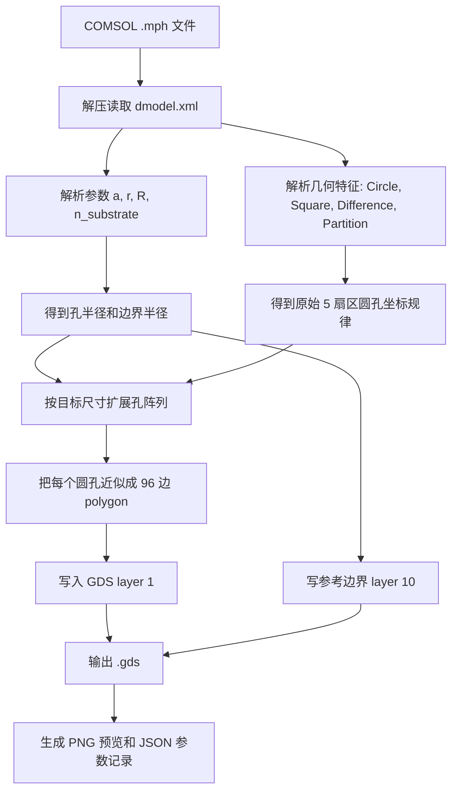

# 总流程图

这次“画图”不是用鼠标画，也不是从图片描边，而是通过脚本把 COMSOL 几何参数重新画成 GDS 多边形。

## 每一步做了什么

1. `.mph` 文件本质上是一个压缩容器，里面有 `dmodel.xml` 和很多二进制几何数据。
2. 脚本读取 `dmodel.xml`，找到 COMSOL 的几何特征。
3. 原始文件里已经有 1125 个 `circle_*` 圆孔，这说明 `.mph` 保存了真实几何，而不只是仿真结果图。
4. 对普通版本，脚本直接把这些圆孔转换成 GDS。
5. 对 20 um、50 um、100 um 扩展版，脚本保持 `a/r/R` 不变，只按同样的 disclination 规律向外补更多孔。
6. 每个圆孔在 GDS 里不是“真正的数学圆”，而是用 96 个点的多边形近似。

## 为什么不能用截图

截图包含：

- 颜色场分布
- 坐标轴
- COMSOL 界面
- 色标
- 抗锯齿边缘
- 缩放误差

这些都不是加工几何。用截图描边会导致孔径、孔距、轮廓拓扑都不可靠。

> [!note] 拓扑是什么意思
> 这里的拓扑可以理解为图形之间的连接关系。例如两个孔是否重叠、边界是否闭合、有没有多余碎片。截图描边很容易把这些关系弄错。

