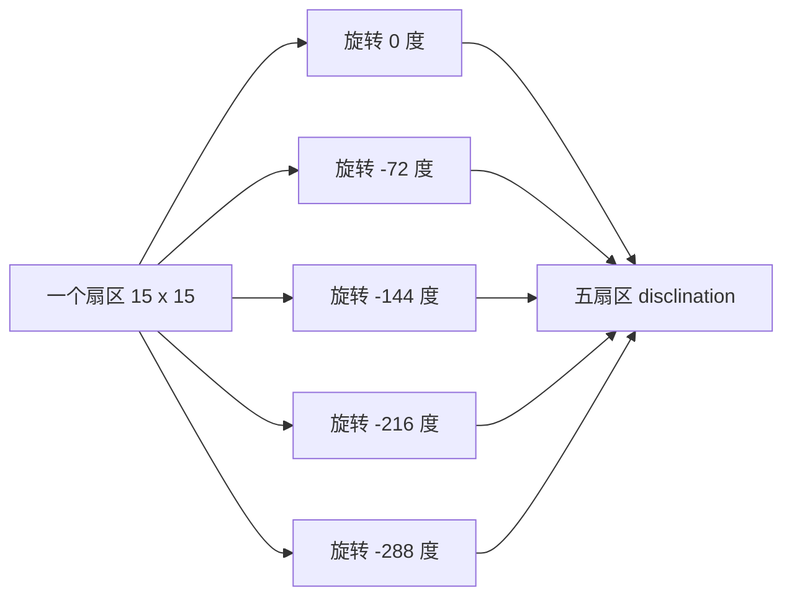

# 如何从参数画出孔阵列

## 基本思想

每个孔由三个量决定：

```text
x = 孔中心横坐标
y = 孔中心纵坐标
r = 孔半径
```

其中 `x/y/r` 都用 `um` 作为单位。

对于截图图 1 参数：

```text
a = 554 nm = 0.554 um
r = 0.2a = 0.1108 um
R = 18a = 9.972 um
```

`a` 是晶格常数，可以理解为孔阵列的基本间距尺度。`r` 是圆孔半径。`R` 在当前 GDS 里作为参考边界，不参与外圈补阵列的缩放。

## 原始阵列规律

原始 COMSOL 文件中的 1125 个孔可以拆成：

```text
5 个扇区 x 15 行 x 15 列 = 1125 个孔
```

脚本从原始孔坐标反推出一个扇区的规律，然后把这个扇区旋转 5 次，得到五角 disclination 结构。



## 为什么 50 um 不能整体缩放

错误做法是：

```text
把所有 x/y/r 都乘以一个倍数
```

这样会导致：

- `a` 变大
- `r` 变大
- 孔距变大
- 原始单元物理尺寸被破坏

正确做法是：

```text
保持 a 和 r 不变，只增加行数和列数
```

例如：

| 目标尺寸 | 扩展阵列 | 孔数 | 实际外包络直径 |
|---|---:|---:|---:|
| 原始图 1 | `5 x 15 x 15` | 1125 | 12.3274 um |
| 20 um | `5 x 23 x 23` | 2645 | 19.1475 um |
| 50 um | `5 x 59 x 59` | 17405 | 49.8382 um |
| 100 um | `5 x 117 x 117` | 68445 | 99.2842 um |

## 为什么实际尺寸不是刚好 20/50/100 um

因为阵列只能按“整行整列”增加，不能加半行孔。脚本选择最接近目标尺寸的奇数阶数。

例如图 1 参数的 100 um：

```text
grid size = 117
实际外包络直径 = 99.2842 um
```

这已经是保持 `a=554 nm` 和 `r=0.2a` 不变时最接近 100 um 的自然阵列尺寸之一。

## 脚本对应位置

- 一个扇区的归一化坐标：`first_sector_disclination_points`
- 自动选择阵列阶数：`choose_grid_size_for_target`
- 生成扩展孔阵列：`generate_extended_disclination_holes`

