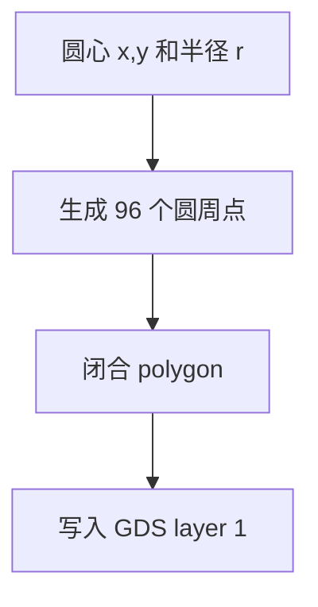

# GDS 文件是怎样写出来的

## GDS 是什么

GDSII 是微纳加工常用的版图文件格式。它不是图片，而是由很多几何图形组成的二进制文件。

这次 GDS 中最重要的图形是：

- 圆孔：写到 layer 1
- 参考边界：写到 layer 10
- 文本标注：写到 layer 20

## 圆孔如何变成 GDS 图形

GDS 本身主要保存 polygon，也就是多边形。数学上的圆要近似成多边形。

本脚本默认：

```text
一个圆 = 96 个点的多边形
```

流程：



> [!note] polygon 是什么
> polygon 就是多边形。GDS 里常用多边形表达光刻图形。96 边形看起来已经很接近圆。

## 单位如何处理

脚本内部单位：

```text
um
```

GDS 写入时：

```text
1 user unit = 1 um
database precision = 1 nm
```

意思是：坐标以微米为基本单位，但最小坐标精度到纳米级。

## 为什么没有用 gdstk/gdspy

本机没有安装：

- `gdstk`
- `gdspy`

所以脚本使用了内置的 `SimpleGDSWriter`。它直接写 GDSII stream 记录，生成的文件已被系统识别为：

```text
GDSII Stream file
```

如果以后安装了 `gdstk`，脚本会优先使用 `gdstk`。

## GDS layer 定义

| layer | 含义 | 是否用于加工 |
|---:|---|---|
| 1 | 主体刻蚀区域/光子晶体圆孔 | 是 |
| 10 | 参考边界、substrate、PML、分区 square | 仅参考 |
| 20 | 文本标注 | 仅参考 |

## 基本检查做了什么

脚本会记录：

- 孔数量
- 最小孔径
- 最小孔边距
- 是否超出参考圆
- GDS 写入方式

> [!warning] 最小孔边距为负数
> 当前结构中最小孔边距为负数，说明有些同层圆孔重叠。这可能是设计中的 clover/组合孔结构需要，但送厂前建议在 KLayout 中做 Boolean union。

Boolean union 的意思是“布尔并集”，也就是把重叠的同层图形合并成一个整体图形。

