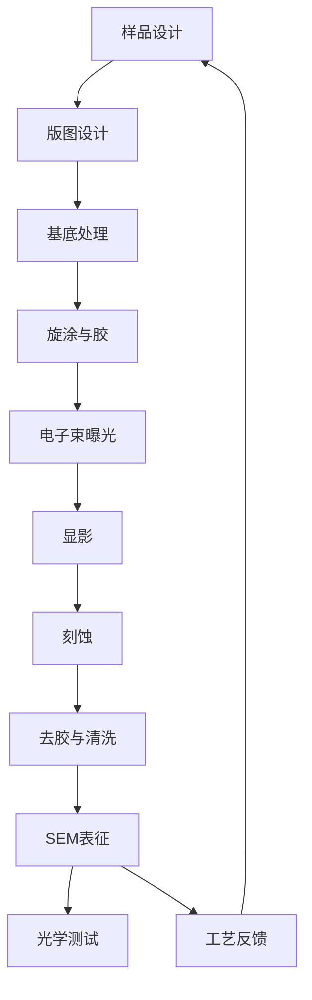

# 加工总流程

## 文件夹用途

这里记录从样品设计到 SEM 表征的完整加工过程。目标是让每一次加工都能追溯到器件编号、版图版本、工艺参数和最终形貌。

## 推荐记录什么内容

- 样品设计：结构尺寸、材料、目标模式、对应仿真。
- 版图设计：GDS 文件版本、阵列排布、对准标记。
- 基底处理：基底来源、清洗方法、烘烤条件。
- 旋涂与胶：胶型号、转速、时间、烘烤温度。
- 电子束曝光：剂量、步进、束流、写场、设备状态。
- 显影：显影液、时间、温度、冲洗方式。
- 刻蚀：气体流量、功率、压强、时间、刻蚀深度。
- 去胶与清洗：去胶方法、清洗液、是否损伤结构。
- SEM 表征：拍摄位置、倍率、尺寸偏差、粗糙度判断。
- 问题记录：把失败样品也记录下来，失败样品通常最有价值。

## 当前加工入口

- 当前加工主线：[[微腔加工与光学测试/02-微腔加工/01-样品设计/Disclination当前加工入口|Disclination 当前加工入口]]
- disclination 加工路线总结：[[微腔加工与光学测试/02-微腔加工/SOP/Disclination-vortex加工路线总结|Disclination-vortex 加工路线总结]]
- disclination 样品：[[微腔加工与光学测试/02-微腔加工/01-样品设计/MC-20260514-01-样品与器件索引|MC-20260514-01 样品与器件索引]]
- disclination GDS：[[微腔加工与光学测试/02-微腔加工/02-版图设计/GDS-mj20260420-版图索引|GDS-mj20260420 版图索引]]
- disclination 工艺参数：[[微腔加工与光学测试/02-微腔加工/10-工艺参数数据库/MC-20260514-01-工艺参数卡|MC-20260514-01 工艺参数卡]]
- Dirac-vortex 已加工样品：[[微腔加工与光学测试/02-微腔加工/01-样品设计/Dirac-vortex已加工样品索引|Dirac-vortex 已加工样品索引]]

## 推荐加工闭环



## 和其他文件夹如何双链关联

- 每个加工批次链接到器件页：`[[DV-DISC-2026-001]]`。
- 版图记录链接到 [[微腔加工与光学测试/01-项目总览/器件编号规则|器件编号规则]] 和 GDS 文件说明。
- SEM 记录链接到 [[微腔加工与光学测试/03-光学测试/00-测试总流程|测试总流程]]，方便解释测试异常。
- 加工问题链接到 [[微腔加工与光学测试/templates/问题排查模板|问题排查模板]]。
- 数据可用于 [[微腔加工与光学测试/06-论文与汇报/00-论文汇报索引|论文与汇报]] 中的工艺图。

## 推荐双链格式

```markdown
器件：[[DV-DISC-2026-001]]
版图：[[GDS-DV-DISC-2026-001]]
加工批次：[[加工批次-2026-05-14-DV-DISC-2026-001]]
SEM：[[SEM-DV-DISC-2026-001]]
测试：[[测试-2026-05-14-DV-DISC-2026-001]]
问题：[[问题-曝光剂量不足-DV-DISC-2026-001]]
```

## 建议命名

- 加工批次：`加工批次-YYYY-MM-DD-器件编号`
- 工艺问题：`问题-简短描述-器件编号`
- SEM 记录：`SEM-器件编号-YYYY-MM-DD`
