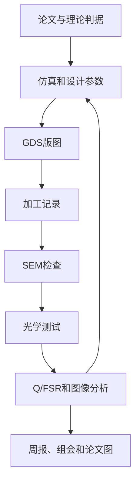

# 微腔加工与光学测试

这是当前 `20-Projects/` 的主入口。这里管理两篇拓扑光子/微腔论文复现，以及由此产生的设计、GDS、加工、光学测试、数据分析和汇报材料。

## 当前主线

| 工作线 | 当前状态 | 近期重点 | 入口 |
|---|---|---|---|
| Dirac-vortex topological cavities | 已加工，等待光学测试 | 找共振、拟合 Q/FSR、记录近场/远场/偏振和背景对照 | [[06_Optical_Test/Dirac-vortex已加工样品光学测试入口|Dirac-vortex 光学测试入口]] |
| Photonic disclination cavity | 正在加工 | 补齐 GDS、曝光、刻蚀、SEM 和工艺问题记录 | [[04_weijiagong/微腔加工样品记录 2026-05-14|MC-20260514-01 样品记录]] |

术语说明：

- GDS：微纳加工常用的版图文件，也就是送去曝光设备的图形文件。
- SEM：扫描电子显微镜，用来检查孔径、周期、边缘粗糙度和结构是否完整。
- Q/FSR：Q 是共振峰品质因数，FSR 是同一腔内相邻模式的波长间隔。

## 两篇论文复现主线

### Dirac-vortex topological cavities

- 参考 PDF：`90-Local_Not_Upload/PDF/papers/03_topological_photonics/Dirac-vortex topological cavities.pdf`
- 当前样品：Dirac cavity 已加工，信息待补。
- 测试目标：找共振峰或共振谷，拟合 Q 和 FSR，补近场、远场、偏振和背景对照。
- 相关入口：
  - [[04_weijiagong/Dirac-vortex已加工样品索引|Dirac-vortex 已加工样品索引]]
  - [[06_Optical_Test/00-测试总流程|测试总流程]]
  - [[06_Optical_Test/Dirac-vortex光学测试判据总结|Dirac-vortex 光学测试判据总结]]
  - [[07_Result/Q与FSR数据处理入口|Q 与 FSR 数据处理入口]]

### Vortex nanolaser based on a photonic disclination cavity

- 参考 PDF：`90-Local_Not_Upload/PDF/papers/02_on_chip_lasers/Vortex nanolaser based on a photonic disclination cavity.pdf`
- 当前样品：`MC-20260514-01`，裸硅 disclination vortex 微腔样品。
- 当前状态：已曝光，刻蚀、SEM 和光学测试待补。
- 相关入口：
  - [[04_weijiagong/Disclination-vortex加工路线总结|Disclination-vortex 加工路线总结]]
  - [[04_weijiagong/微腔加工样品记录 2026-05-14|微腔加工样品记录]]
  - [[03_GDS_layout/GDS-mj20260420-版图索引|GDS-mj20260420 版图索引]]
  - [[03_GDS_layout/Disclination_vortex_old/README|Disclination_vortex GDS 资料]]

## 科研闭环



记录时优先保持这条链路完整：每个器件都能从论文参数追溯到 GDS、加工条件、SEM、测试数据和最终图表。

## 目录结构

| 目录 | 用途 |
|---|---|
| `01_Paper_read/` | 两篇论文的阅读入口和参数提取。 |
| `02_Comsol_samulation/` | COMSOL 仿真相关材料。COMSOL 是常用的有限元仿真软件。 |
| `03_GDS_layout/` | GDS 版图、生成脚本和版图参数索引。 |
| `04_weijiagong/` | 加工流程、样品记录、器件编号、工艺参数和 SEM 信息。 |
| `05_Experiment_Log/` | 每日实验日志和日志模板。 |
| `06_Optical_Test/` | 光学测试计划、测试入口和模式判据。 |
| `07_Result/` | 数据分析入口，包含 Q/FSR 处理。 |
| `09-papers_presentations/` | 论文图、周报、组会和复现清单。 |
| `00_Templates/` | 器件、加工、测试和数据分析模板。 |
| `Skills/` | Codex / Obsidian 工具说明，不属于科研主线。 |

## 近期行动

1. Dirac-vortex 测试前，补齐已加工样品的批次、GDS、SEM 和器件坐标。
2. 光学测试时保存粗扫、细扫、背景谱、偏振角、近场图和远场图。
3. 数据分析先走 [[07_Result/Q与FSR数据处理入口|Q 与 FSR 数据处理入口]]，不要只凭一个峰判断模式身份。
4. Disclination 加工线继续补曝光、刻蚀、去胶、SEM 和工艺问题记录。
5. 每次能用于汇报的结果都链接到 [[09-papers_presentations/论文模仿路线与图表复现清单|论文模仿路线与图表复现清单]]。

## 总控表

| 模块 | Dirac-vortex | Photonic disclination cavity | 当前状态 | 下一步 |
|---|---|---|---|---|
| 文献参数 | 待补完整参数 | 待补模式判据 | 进行中 | 提取几何、材料、边界条件和目标输出。 |
| 仿真 | 待整理 | 待整理 | 未系统化 | 建参数表，记录输入和输出。 |
| GDS 版图 | 历史资料在 `03_GDS_layout/Dirac_vortex/` | `mj20260420_01` 到 `mj20260420_06` 已整理 | 进行中 | 固定最终输出路径，补 KLayout 截图。 |
| 加工 | 已加工，信息待补 | `MC-20260514-01` 已曝光 | 进行中 | 补刻蚀、SEM 和问题记录。 |
| 光学测试 | 当前优先 | 加工完成后预留 | 待测 | 建立测试记录并保存原始数据路径。 |
| 数据分析 | Q/FSR、近场/远场 | 后续复用同一分析流程 | 待测后开始 | 用统一表格记录拟合结果。 |

## 编号规则

器件编号使用：

```text
DV-DISC-YYYY-NNN
```

示例：`DV-DISC-2026-001`。详细规则见 [[04_weijiagong/器件编号规则|器件编号规则]]。
