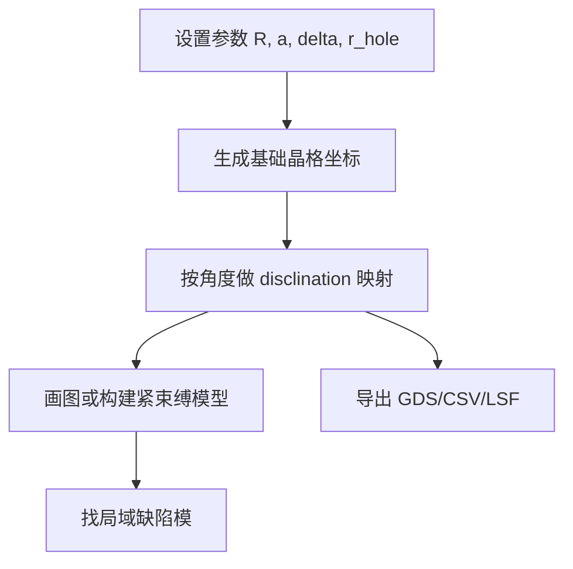

# Disclination vortex Python代码学习笔记

> [!note] 阅读目标
> 这份笔记帮你按顺序读懂本目录的 Python 代码：先理解坐标怎么生成，再理解旋错怎么施加，最后理解如何导出 GDS 和如何用紧束缚模型看缺陷模。

## 1. 先记住几个术语

- `Python 脚本`：以 `.py` 结尾的文件，可以直接运行。
- `函数`：用 `def` 定义的一段可重复使用的代码，例如 `generate_sites()`。
- `参数`：传给函数或脚本的可调数值，例如 `R`、`a`、`r_hole`。
- `NumPy`：Python 的数值计算库，常用名字是 `np`，负责数组、矩阵、三角函数。
- `Matplotlib`：画图用的库，常用名字是 `plt`。
- `GDS`：芯片版图文件格式，后续可以给 KLayout、加工流程或版图检查使用。
- `KLayout / gdspy`：两个生成 GDS 的 Python 工具。
- `disclination`：旋错缺陷，可以理解为“切掉或插入一个角扇区后再把结构拼起来”。
- `TB / tight-binding / 紧束缚模型`：用矩阵近似描述格点之间耦合的模型。
- `Hamiltonian / 哈密顿量`：紧束缚模型里的核心矩阵，代码中常写成 `H`。
- `eigenvalue / 本征值`：矩阵求解出来的能量或频率指标，代码中常写成 `E`。
- `eigenvector / 本征向量`：每个模态在各个格点上的分布，代码中常写成 `V` 或 `psi`。

## 2. 推荐阅读顺序

1. 先看 `todo/square_lattice_volterra_sector_geometry.py` 和 `todo/plot_resonator_csv_scatter_preview.py`
   - 目的：理解“生成点阵”和“画出点阵”。
   - 重点：`generate_structure()` 生成 `(x, y)` 坐标，`plot_structure()` 把坐标画出来。

2. 再看 `disclination_vortex_1.ipynb`
   - 目的：按 Notebook 单元一步一步理解六边形晶格和旋错映射。
   - 重点：先生成 `site`，再生成 `site_disclination`。

3. 再看 `disclination_vortex_gds.py`
   - 目的：理解最终 GDS 是怎么批量生成的。
   - 重点：`generate_sites()`、`apply_disclination()`、`write_gds()`。

4. 然后看 `figure2/square_lattice_tb_demo_pipeline.py`
   - 目的：理解一个完整的数值模拟流程。
   - 重点：生成晶格、施加旋错、构建哈密顿量、求解、画图。

5. 最后看 `figure2/c5_kdtree_zero_mode_analysis.py` 和 `figure2/robust_c5_disclination_gds_with_mode_preview.py`
   - 目的：理解更成熟的搜索近邻、求解局域模、导出 GDS 的做法。
   - 重点：`KDTree` 用来快速找近邻，`gdspy` 用来写 GDS。

## 3. 主线代码逻辑

整个项目可以理解成 5 个步骤：



### 步骤 1：设置参数

常见参数含义：

| 参数 | 含义 | 例子 |
| --- | --- | --- |
| `a` | 晶格常数，也就是相邻晶胞的尺度 | `a = 0.554` 或 `a = 400.0` |
| `R` | 样品半径或晶格范围 | `R = 60` |
| `delta` | 胞内点偏移量，影响强弱耦合 | `delta = 0.35` |
| `r_hole` | 空气孔半径 | `r_hole = 0.12 * a` |
| `target_n` | 目标旋转对称性，例如 C5 | `target_n = 5` |
| `t1`, `t2` | 紧束缚模型的弱/强耦合 | `t1 = -0.2`, `t2 = -1.0` |

### 步骤 2：生成晶格点

基础思路是：用两层 `for` 循环遍历整数坐标，再把整数坐标换成实际坐标。

```python
for i in range(Nx):
    for j in range(Ny):
        x = i * a
        y = j * a
        pos.append((x, y))
```

这段的意思是：`i` 控制横向第几个点，`j` 控制纵向第几个点，乘上 `a` 后得到真实坐标。

在六边形版本里，不是所有点都保留，而是通过 `is_point_in_hexagon()` 判断点是否落在六边形内部。

### 步骤 3：施加旋错映射

旋错通常通过极坐标做：

1. 用 `r = np.linalg.norm(point)` 得到半径。
2. 用 `theta = np.arctan2(y, x)` 得到角度。
3. 删除某个角区。
4. 把剩余角度乘一个比例，例如 `6/5` 或 `4/3`。
5. 再用 `cos`、`sin` 转回 `(x, y)`。

核心代码形式：

```python
mapped_theta = theta * angle_ratio
mapped_r = r * radius_ratio
new_point = np.array([
    mapped_r * np.cos(mapped_theta),
    mapped_r * np.sin(mapped_theta),
])
```

这里的 `angle_ratio` 是角度拉伸比例。比如 `6/5` 可以理解为：原来保留下来的 5 份角区被重新拉伸成 6 份。

### 步骤 4：构建紧束缚模型

紧束缚模型的核心是矩阵 `H`。

```python
H = np.zeros((num, num), dtype=complex)
```

意思是创建一个 `num x num` 的矩阵。每个格点对应矩阵的一行和一列。如果两个格点距离足够近，就在矩阵里填入耦合强度。

常见判断：

```python
if r < d_intra:
    H[i, j] = H[j, i] = t1
elif r < d_inter:
    H[i, j] = H[j, i] = t2
```

这里 `H[i, j] = H[j, i]` 是为了让矩阵保持对称，表示从 `i` 到 `j` 和从 `j` 到 `i` 的耦合一样。

### 步骤 5：求解和画图

求解矩阵：

```python
E, V = np.linalg.eigh(H)
```

- `E`：所有能级。
- `V`：所有模态分布。

找局域模时常用 `IPR`：

```python
iprs = np.sum(np.abs(V)**4, axis=0)
target_idx = np.argmax(iprs)
```

`IPR` 越大，说明模态越集中在少数格点上，越像局域缺陷模。

## 4. 文件地图

| 文件 | 主要作用 |
| --- | --- |
| `disclination_vortex_gds.py` | 六边形 disclination vortex GDS 批量生成主脚本 |
| `10-design_generation_scripts/disclination_vortex_gds.py` | 四边形裁剪版本的 GDS 生成脚本 |
| `gds_template_1.py` | 三角孔 vortex GDS 模板 |
| `environment.yml` | Conda 运行环境配置 |
| `todo/square_lattice_volterra_sector_geometry.py` | 生成点阵、删除扇区 |
| `visualize.py` | 画二维点阵 |
| `export_comsol.py` | 导出 CSV |
| `export_lumerical.py` | 导出 Lumerical `.lsf` 脚本 |
| `structure.lsf` | Lumerical 中添加圆孔的脚本，由 Python 生成 |
| `figure2/square_lattice_disclination_geometry.py` | 基础晶格和旋错变换函数 |
| `figure2/tight_binding_hamiltonian_builder.py` | 简化紧束缚矩阵构建 |
| `figure2/tight_binding_eigensolver.py` | 求解哈密顿量 |
| `figure2/lattice_mode_plotting_helpers.py` | 画晶格、能谱、模式相位 |
| `figure2/c5_kdtree_zero_mode_analysis.py` | KDTree 快速近邻搜索和零模可视化 |
| `figure2/robust_c5_disclination_gds_with_mode_preview.py` | 稳健版 GDS 导出与预览 |

## 5. 你可以怎么改参数

> [!warning] 改参数前先复制输出文件名
> 多个脚本会直接生成 GDS 或 CSV。改参数前最好确认输出文件名，避免覆盖你想保留的结果。

常见改法：

- 想让样品更大：调大 `R`、`Nx`、`Ny`。
- 想改变空气孔大小：调 `r_hole` 或 `r_ratio`。
- 想改变晶格尺度：调 `a`。
- 想看不同旋错对称性：调 `target_n`。
- 想改变拓扑相：调 `t1`、`t2`，通常强弱耦合差距越大，局域态越明显。
- 想让中心孔不重叠：看 `figure2/center_protected_variable_radius_gds_export.py`，它用 `center_r_scale` 缩小中心区域孔半径。

## 6. 常见报错怎么理解

### `ModuleNotFoundError`

意思是缺少库。例如：

```text
ModuleNotFoundError: No module named 'gdspy'
```

说明当前 Python 环境没有安装 `gdspy`。

### `IndexError` 或 `list indices must be integers`

常见原因是把 Python 列表当 NumPy 数组切片。例如：

```python
site_disclination[:, 0]
```

只有 `site_disclination = np.array(site_disclination)` 之后，这种二维切片才成立。

### GDS 打不开或很卡

常见原因：

- 圆孔点数太多，例如 `number_of_points=128`。
- 孔之间重叠，布尔合并生成复杂多边形。
- 阵列尺寸太大。

可以优先看 `figure2/stable_low_complexity_c5_gds_export.py`，它通过降低阵列规模和圆孔点数来提高稳定性。

## 7. 最小学习路线

如果你只想先跑通，不急着完全理解，按这个顺序：

1. 打开 `disclination_vortex_1.ipynb`，从上到下运行。
2. 看每个代码单元输出的图，确认“原始晶格”和“旋错后晶格”的区别。
3. 打开 `disclination_vortex_gds.py`，只改 `PARAM_SETS`、`R`、`OUTPUT_DIR`。
4. 运行脚本，生成 GDS。
5. 用 KLayout 打开 GDS，检查孔阵列和文字标识。
6. 再回来看 `figure2/square_lattice_tb_demo_pipeline.py`，理解紧束缚求解流程。

## 8. 一句话总结

这个目录的 Python 代码本质上是在做三件事：先用数学公式生成二维点阵，再用角度映射制造旋错缺陷，最后把点阵变成图、矩阵模型或 GDS 版图。
