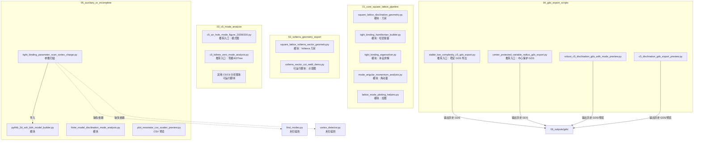

# Python 文件调用关系 README

生成日期：2026-05-19

本 README 递归扫描当前项目目录下所有 `.py` 文件生成：

`03_GDS_layout/Disclination_vortex/03_paper_figure2_derivation_by_mengjie/`

说明：

- `if __name__ == "__main__"` 是 Python 常见的标准入口保护，意思是“只有直接运行这个文件时才执行这一段代码，被别的文件导入时不执行”。
- `模块` 指主要定义函数/类，通常给其他脚本调用。
- `可运行脚本` 指文件中存在顶层执行代码；即使没有 `if __name__ == "__main__"`，直接运行也会执行。
- 本次只分析和更新 README，没有修改任何 `.py` 代码。

## 总结

- 扫描到 `.py` 文件：24 个
- 含 `if __name__ == "__main__"`：0 个
- 判断为模块：9 个
- 判断为可运行脚本：15 个
- 明确的项目内部导入关系：1 条

## 推荐入口文件

| 推荐用途 | 推荐入口文件 | 原因 | 注意 |
|---|---|---|---|
| 读 Fig.2/C5 模式复现主线 | `03_c5_mode_analysis/c5_air_hole_mode_figure_20260330.py` | 文件名有日期和 air-hole mode，内容集中在 C5 空气孔模式图 | 无 `main` 保护，运行会直接执行顶层代码 |
| 分析 C5 零模和近邻搜索 | `03_c5_mode_analysis/c5_kdtree_zero_mode_analysis.py` | 使用 KDTree 搜索近邻，结构较清楚 | 需要 `scipy` |
| 稳定版 GDS 历史导出 | `04_gds_export_scripts/stable_low_complexity_c5_gds_export.py` | 文件名明确为 stable/low-complexity，适合作为历史 GDS 导出参考 | 需要 `gdspy` |
| 中心保护 GDS 历史导出 | `04_gds_export_scripts/center_protected_variable_radius_gds_export.py` | 明确处理中心孔半径保护 | 需要 `gdspy` |
| 基础方形晶格函数阅读 | `01_core_square_lattice_pipeline/square_lattice_disclination_geometry.py` | 只定义核心几何函数，适合先读 | 是模块，不是完整入口 |

不推荐作为直接入口：

- `05_auxiliary_or_incomplete/tight_binding_parameter_scan_vortex_charge.py`：引用 `find_modes` 和 `vortex_detector`，当前项目内没有扫描到这两个模块。
- `05_auxiliary_or_incomplete/plot_resonator_csv_scatter_preview.py`：需要 `resonators.csv`，当前目录内未见该数据文件。

## 文件逐项分析

| 文件路径 | 是否含 `if __name__ == "__main__"` | 判断 | 导入关系 | 说明 |
|---|---|---|---|---|
| `01_core_square_lattice_pipeline/lattice_mode_plotting_helpers.py` | 否 | 模块 | `matplotlib.pyplot`, `numpy` | 绘图辅助函数：晶格、能谱、模式相位 |
| `01_core_square_lattice_pipeline/mode_angular_momentum_analysis.py` | 否 | 模块 | `numpy` | 模式角动量分析函数 |
| `01_core_square_lattice_pipeline/square_lattice_disclination_geometry.py` | 否 | 模块 | `numpy` | 方形晶格生成和 disclination 映射函数 |
| `01_core_square_lattice_pipeline/tight_binding_eigensolver.py` | 否 | 模块 | `numpy` | 紧束缚矩阵本征求解函数 |
| `01_core_square_lattice_pipeline/tight_binding_hamiltonian_builder.py` | 否 | 模块 | `numpy` | 构建紧束缚哈密顿量函数；哈密顿量是描述耦合关系的矩阵 |
| `02_volterra_geometry_export/square_lattice_volterra_sector_geometry.py` | 否 | 模块 | `numpy` | 生成方形点阵并移除扇区 |
| `02_volterra_geometry_export/volterra_sector_cut_weld_demo.py` | 否 | 可运行脚本 | `numpy`, `matplotlib.pyplot` | Volterra 切割/粘合示意图脚本 |
| `03_c5_mode_analysis/bond_center_cut_c6_lattice_mode_demo.py` | 否 | 可运行脚本 | `numpy`, `matplotlib.pyplot` | bond-center cut 的 C6/C5 模式示例 |
| `03_c5_mode_analysis/c5_air_hole_mode_figure_20260330.py` | 否 | 可运行脚本 | `numpy`, `matplotlib.pyplot`, `matplotlib.patches` | C5 空气孔模式图脚本 |
| `03_c5_mode_analysis/c5_cell_center_cut_mode_workflow_0325.py` | 否 | 可运行脚本 | `numpy`, `matplotlib.pyplot` | 2026-03-25 C5 cell-center 工作流 |
| `03_c5_mode_analysis/c5_core_edge_adjusted_zero_mode.py` | 否 | 可运行脚本 | `numpy`, `matplotlib.pyplot` | 调整核心/边缘耦合观察零模 |
| `03_c5_mode_analysis/c5_ipr_localized_mode_analysis_0327.py` | 否 | 可运行脚本 | `numpy`, `matplotlib.pyplot` | IPR 局域模式分析；IPR 用于判断模式是否集中在局部 |
| `03_c5_mode_analysis/c5_kdtree_zero_mode_analysis.py` | 否 | 可运行脚本 | `numpy`, `matplotlib.pyplot`, `scipy.spatial` | KDTree 近邻搜索和零模分析 |
| `03_c5_mode_analysis/c5_tagged_sector_refined_coupling.py` | 否 | 可运行脚本 | `numpy`, `matplotlib.pyplot` | 按扇区标签细化耦合 |
| `03_c5_mode_analysis/cell_center_cut_c5_lattice_workflow.py` | 否 | 可运行脚本 | `numpy`, `matplotlib.pyplot` | cell-center cut C5 工作流 |
| `03_c5_mode_analysis/center_aggregated_c5_mode_delta_scan.py` | 否 | 可运行脚本 | `numpy`, `matplotlib.pyplot` | 扫描中心聚集参数 delta |
| `04_gds_export_scripts/c5_disclination_gds_export_preview.py` | 否 | 可运行脚本 | `numpy`, `gdspy`, `pathlib`, `matplotlib.pyplot` | 早期 C5 disclination GDS 导出预览 |
| `04_gds_export_scripts/center_protected_variable_radius_gds_export.py` | 否 | 可运行脚本 | `numpy`, `gdspy`, `pathlib` | 中心孔半径保护版 GDS 导出 |
| `04_gds_export_scripts/robust_c5_disclination_gds_with_mode_preview.py` | 否 | 可运行脚本 | `numpy`, `gdspy`, `matplotlib.pyplot`, `matplotlib.patches`, `pathlib` | robust 版 C5 GDS 导出并预览模式 |
| `04_gds_export_scripts/stable_low_complexity_c5_gds_export.py` | 否 | 可运行脚本 | `numpy`, `gdspy`, `pathlib` | 低复杂度稳定版 C5 GDS 导出 |
| `05_auxiliary_or_incomplete/finite_model_disclination_mode_analysis.py` | 否 | 模块 | `numpy` | 有限模型、disclination、缺陷模和 vortex charge 函数 |
| `05_auxiliary_or_incomplete/plot_resonator_csv_scatter_preview.py` | 否 | 可运行脚本 | `numpy`, `matplotlib.pyplot` | 读取 `resonators.csv` 并画散点图 |
| `05_auxiliary_or_incomplete/pythtb_2d_ssh_bbh_model_builder.py` | 否 | 模块 | `pythtb`, `numpy` | 用 `pythtb` 构建二维 SSH/BBH 模型 |
| `05_auxiliary_or_incomplete/tight_binding_parameter_scan_vortex_charge.py` | 否 | 模块 | `numpy`, `pythtb_2d_ssh_bbh_model_builder`, `find_modes`, `vortex_detector` | 参数扫描函数；依赖缺失模块 |

## 谁调用谁

当前项目内部明确扫描到的 Python 文件之间调用/导入关系：

| 调用方 | 被调用/导入方 | 关系 |
|---|---|---|
| `05_auxiliary_or_incomplete/tight_binding_parameter_scan_vortex_charge.py` | `05_auxiliary_or_incomplete/pythtb_2d_ssh_bbh_model_builder.py` | `from pythtb_2d_ssh_bbh_model_builder import *` |

未发现其他 `.py` 文件显式导入当前项目内的 `.py` 文件。很多脚本是“独立探索脚本”：自己定义参数、自己构建矩阵、自己画图或导出 GDS。

## 外部依赖

| 依赖 | 被哪些脚本使用 | 说明 |
|---|---|---|
| `numpy` | 大多数脚本 | 数值计算库 |
| `matplotlib` | C5 分析、绘图脚本 | 画图和可视化 |
| `scipy.spatial` | `c5_kdtree_zero_mode_analysis.py` | KDTree 近邻搜索 |
| `gdspy` | `04_gds_export_scripts/` 下 GDS 导出脚本 | GDSII 版图生成库 |
| `pythtb` | `pythtb_2d_ssh_bbh_model_builder.py` | tight-binding 建模库 |
| `find_modes` | `tight_binding_parameter_scan_vortex_charge.py` | 当前目录未扫描到，待补齐 |
| `vortex_detector` | `tight_binding_parameter_scan_vortex_charge.py` | 当前目录未扫描到，待补齐 |

## Mermaid 调用关系图

## 结论

当前目录更像“论文 Fig.2 复现探索脚本集合”，不是一个统一的软件包。大部分脚本没有标准 `main` 入口，也没有形成完整的模块调用链。

后续如果要继续开发，建议先选一个入口脚本复制成新版本，再逐步把核心函数从独立脚本中抽出来，形成清晰的：

1. 几何生成模块；
2. 模式求解模块；
3. GDS 导出模块；
4. 实验参数入口脚本。
