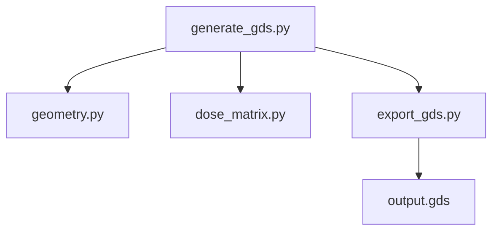

# 04-读懂多文件工程

多文件工程的阅读目标不是逐行看完，而是建立一张“调用地图”。

你需要回答：

1. 哪个文件是入口？
2. 入口调用了哪些模块？
3. 哪些模块负责几何、求解、导出、画图？
4. 输出文件在哪里生成？

## 第一步：列出所有 Python 文件

```bash
find . -name "*.py" | sort
```

把文件按名字先粗分：

| 名字特征 | 可能用途 |
|---|---|
| `geometry`、`lattice`、`structure` | 几何生成 |
| `solver`、`eigen`、`mode` | 求解和模式分析 |
| `plot`、`visualize`、`preview` | 画图 |
| `export`、`gds`、`csv`、`lumerical` | 导出 |
| `run`、`main`、`workflow`、`pipeline` | 主流程 |
| `utils`、`helpers` | 工具函数 |

## 第二步：找 import 关系

```bash
rg -n "^import |^from .* import" .
```

然后区分：

- 外部库：`numpy`、`matplotlib`、`gdspy`、`scipy`
- 项目内部模块：项目里自己写的 `.py`

项目内部模块最重要，因为它告诉你谁调用谁。

## 第三步：找输出

```bash
rg -n "write_gds|savefig|plt.show|to_csv|np.savetxt|open\\(|write\\(" .
```

科研项目最后一定会产生某种结果：

- GDS
- PNG/PDF 图
- CSV/TXT 数据
- npy/npz 数组
- Lumerical/COMSOL 脚本

如果找不到输出，说明它可能只是模块或半成品。

## 第四步：画调用关系图

可以用 Mermaid 画：



这比文字描述更容易看懂。

## 第五步：按功能读，不按文件名顺序读

推荐阅读顺序：

1. README
2. 入口脚本
3. 参数定义
4. 几何生成
5. 求解/仿真
6. 导出文件
7. 画图和后处理
8. 测试或旧脚本

## 典型科研工程分层

```text
project/
├── scripts/        # 可运行脚本
├── src/            # 模块代码
├── data/           # 输入数据
├── outputs/        # 输出结果
├── docs/           # 文档
└── README.md
```

如果一个项目没有这种结构，你可以在阅读笔记里自己建立这个逻辑。

