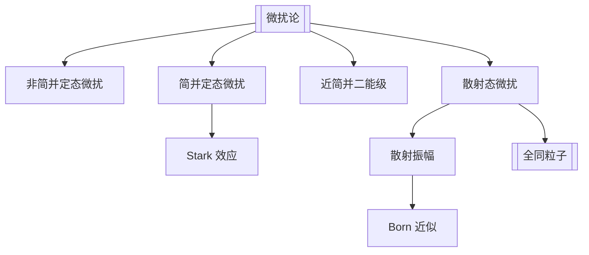

# 第10章 微扰论

## 章节定位

本章处理“严格可解 Hamilton 量 + 小修正”的问题。前半部分是束缚态微扰论，后半部分把微扰思想用于散射态，得到 [[Born 近似]] 和全同粒子散射的交换干涉。

## 目录结构

- 10.1 束缚态微扰论
  - 非简并态微扰论
  - 简并态微扰论
  - Stark 效应与近简并情形
- 10.2 散射态微扰论
  - 散射态描述与微分截面
  - Lippmann-Schwinger 方程
  - Born 近似
  - 全同粒子的散射

## 核心公式

| 主题 | 公式 | 含义 |
|---|---|---|
| Hamilton 量分解 | $H=H_0+H'$ | $H'$ 是相对小的微扰 |
| 一级能量修正 | $E_n^{(1)}=\langle n^{(0)}|H'|n^{(0)}\rangle$ | 非简并态一阶修正 |
| 二级能量修正 | $E_n^{(2)}=\sum_{k\ne n}\frac{|H'_{kn}|^2}{E_n^{(0)}-E_k^{(0)}}$ | 近能级贡献最大 |
| 一级态修正 | $|n^{(1)}\rangle=\sum_{k\ne n}\frac{H'_{kn}}{E_n^{(0)}-E_k^{(0)}}|k^{(0)}\rangle$ | 态混合 |
| 简并微扰 | $\sum_j H'_{ij}c_j=E^{(1)}c_i$ | 在简并子空间中对角化微扰 |
| 微分截面 | $d\sigma/d\Omega=|f(\theta,\phi)|^2$ | 散射角分布 |
| Born 振幅 | $f(\theta,\phi)\propto \int e^{-i\mathbf q\cdot\mathbf r}V(\mathbf r)d^3r$ | 势的 Fourier 分量决定散射 |

## 概念澄清

- 微扰“小”不是只看算符大小，还要看微扰矩阵元与能级间隔的比值。
- 简并态不能直接套非简并公式，必须先在简并子空间中选对零级基。
- 近简并问题最好保留小子空间并精确对角化，会出现避免交叉。
- Born 近似常适合高能、弱势散射；低能强势时可能失败。
- 全同粒子散射振幅要按交换对称性相加或相减，截面会出现交换干涉项。

## 可计算模型

- 综合模型：[[advanced_topics.py]]
- 近简并能级避免交叉：![[avoided_crossing.png]]

## 习题分类

| 题号 | 类型 | 目标 |
|---|---|---|
| 10.1-10.3 | 束缚态微扰 | 计算非简谐振子、耦合谐振子、势阱微扰 |
| 10.4-10.5 | 原子能级微扰 | 核有限大小修正、氢原子 Stark 效应 |
| 10.6 | Born 近似 | 从势函数 Fourier 变换求散射截面 |
| 10.7 | 自旋轨道型微扰 | 处理谐振子壳层分裂和简并度 |

## 下一步精读

- [ ] 拆“非简并/简并/近简并”三张题型卡。
- [ ] 校对 Born 振幅常数因子与单位制。
- [ ] 把全同粒子散射连接到第 4 章交换对称性。
