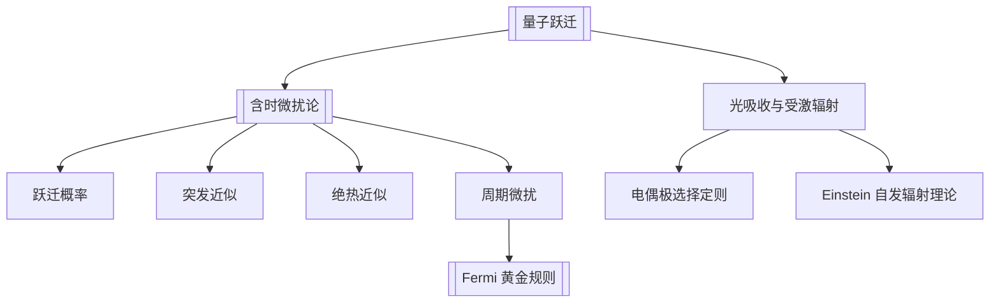

# 第11章 量子跃迁

## 章节定位

本章研究 Hamilton 量含时后，体系从一个定态跃迁到另一个定态的概率。核心工具是含时微扰论，典型结论包括突发近似、绝热近似、周期微扰、Fermi 黄金规则和电偶极跃迁 [[选择定则]]。

## 目录结构

- 11.1 量子态随时间的演化
  - Hamilton 量不含时体系
  - Hamilton 量含时体系的量子跃迁微扰论
  - 量子跃迁理论与定态微扰论的关系
- 11.2 突发微扰与量子绝热近似
- 11.3 周期微扰、有限时间内的常微扰与 [[Fermi 黄金规则]]
- 11.4 能量-时间不确定度关系
- 11.5 光的吸收与辐射的半经典理论

## 核心公式

| 主题 | 公式 | 含义 |
|---|---|---|
| 态展开 | $|\psi(t)\rangle=\sum_n c_n(t)e^{-iE_nt/\hbar}|n\rangle$ | 在 $H_0$ 本征态基中跟踪概率幅 |
| 一级跃迁振幅 | $c_f^{(1)}(t)=\frac{1}{i\hbar}\int_0^t H'_{fi}(t')e^{i\omega_{fi}t'}dt'$ | 含时微扰的一阶结果 |
| 跃迁概率 | $P_{i\to f}=|c_f^{(1)}(t)|^2$ | 一级近似要求概率较小 |
| 黄金规则 | $w_{i\to f}=\frac{2\pi}{\hbar}|H'_{fi}|^2\rho(E_f)$ | 连续末态中的跃迁速率 |
| 绝热条件 | $\left|\frac{\langle m(t)|\dot H|n(t)\rangle}{(E_m-E_n)^2}\right|\ll 1$ | 慢变 Hamilton 量中抑制跃迁 |
| 电偶极微扰 | $H'=-\mathbf d\cdot\mathbf E(t)$ | 半经典光吸收与受激辐射 |
| 电偶极选择定则 | $\Delta l=\pm1,\quad \Delta m=0,\pm1$ | 光跃迁的主要角动量规则 |

## 概念澄清

- 定态微扰论可看作把微扰绝热引入后的极限。
- 突发近似中态矢来不及变化，但新 Hamilton 量下的展开系数会变。
- 黄金规则中的 $\delta$ 函数来自长时间极限，实际有限时间对应窄峰。
- 自发辐射不能由非相对论量子力学加经典外场完全解释，本章用 Einstein 半唯象理论处理。

## 可计算模型

- 综合模型：[[advanced_topics.py]]
- 有限时间微扰的能量选择峰：![[fermi_golden_sinc.png]]

## 习题分类

| 题号 | 类型 | 目标 |
|---|---|---|
| 11.1-11.2 | 外场诱导跃迁 | 简谐振动离子、氢原子脉冲电场 |
| 11.3-11.6 | 二能级与自旋跃迁 | 用含时微扰或精确解求跃迁概率 |
| 11.5 相关 | 光吸收与辐射 | 应用电偶极矩阵元和选择定则 |

## 下一步精读

- [ ] 为二能级 Rabi 振荡补独立模型。
- [ ] 校对电偶极选择定则与球谐函数积分。
- [ ] 把 Einstein 系数与统计物理中的黑体辐射连接。
