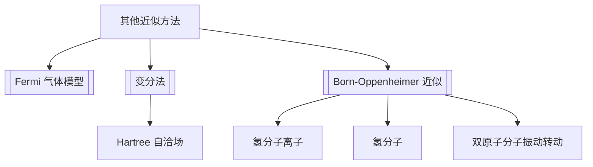

# 第12章 其他近似方法

## 章节定位

本章收束前面章节的模型方法：用 Fermi 气体模型处理多费米子体系，用变分法和 Hartree 自洽场处理不可精确求解的束缚态，用 Born-Oppenheimer 近似把分子中的电子运动与核运动分离。

## 目录结构

- 12.1 [[Fermi 气体模型]]
- 12.2 [[变分法]]
  - 能量本征方程与变分原理
  - Ritz 变分法
  - Hartree 自洽场方法
- 12.3 [[分子结构]]
  - [[Born-Oppenheimer 近似]]
  - 氢分子离子 $H_2^+$ 与氢分子 $H_2$
  - 双原子分子的转动与振动

## 核心公式

| 主题 | 公式 | 含义 |
|---|---|---|
| Fermi 波矢 | $k_F=(3\pi^2 n)^{1/3}$ | 三维自旋 $1/2$ Fermi 气体 |
| Fermi 能量 | $E_F=\frac{\hbar^2k_F^2}{2m}$ | 零温最高占据能量 |
| 平均能量 | $\bar E=\frac35E_F$ | 完全简并三维 Fermi 气体 |
| 变分上界 | $E_0\le \frac{\langle\psi|H|\psi\rangle}{\langle\psi|\psi\rangle}$ | 任意试探态给出基态能量上界 |
| Ritz 条件 | $\partial E(\alpha_i)/\partial\alpha_i=0$ | 变分参数最优化 |
| BO 分解 | $\Psi(\mathbf r,\mathbf R)\approx \psi_e(\mathbf r;\mathbf R)\chi(\mathbf R)$ | 电子快、原子核慢 |
| 双原子转动能 | $E_J=\frac{\hbar^2J(J+1)}{2I}$ | 刚性转子近似 |
| 振动能 | $E_v\simeq \hbar\omega(v+\frac12)$ | 平衡点附近谐振近似 |

## 概念澄清

- Fermi 气体模型把相互作用先忽略，Pauli 原理本身已经产生 Fermi 压和零温能量。
- 变分法的能量通常比波函数更准确；试探函数形式决定近似质量。
- Hartree 方法是平均场思想：每个粒子在其他粒子的平均势中运动。
- Born-Oppenheimer 近似依赖电子与原子核质量差，先固定核位置求电子能量面。
- 分子转动、振动、电子能级通常相差数量级，可近似分离。

## 可计算模型

- 综合模型：[[advanced_topics.py]]
- Fermi 气体占据：![[fermi_occupation.png]]
- 双原子分子有效势：![[molecular_effective_potential.png]]

## 习题分类

| 题号 | 类型 | 目标 |
|---|---|---|
| 12.1 | Fermi 气体 | 推导二维 Fermi 气体态密度、Fermi 能量和平均能量 |
| 12.2-12.4 | 变分法 | 用试探波函数估算谐振子、非简谐振子和氢原子 |
| 12.5 | 核物理变分估算 | 用指数试探函数估算氘核基态 |
| 12.6 | 激发态变分 | 在正交约束下求第一激发态能量上界 |

## 下一步精读

- [ ] 为变分法整理“选试探函数”的题型卡。
- [ ] 补 Fermi 气体二维/三维对照表。
- [ ] 把 Born-Oppenheimer 近似与第 10 章微扰、第 11 章绝热近似连接。
