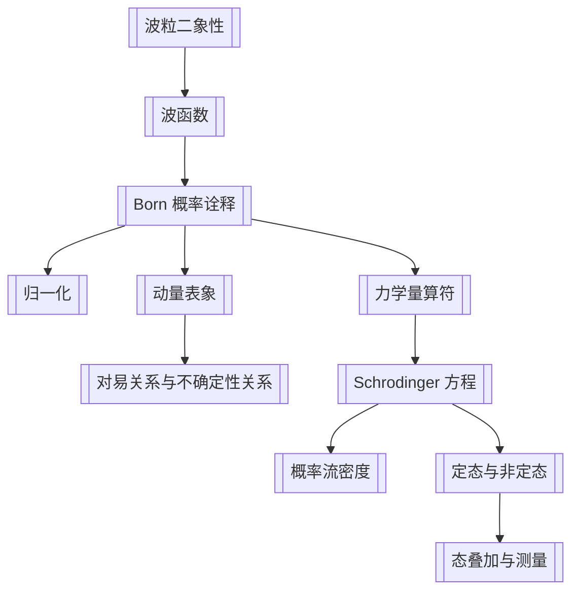

# 第1章 波函数与 Schrodinger 方程

## 章节定位

本章完成量子力学的入门公理链：

## 目录结构

- 1.1 [[波函数]]的统计诠释
  - 1.1.1 [[波粒二象性]]
  - 1.1.2 波粒二象性的分析
  - 1.1.3 [[Born 概率诠释]]；多粒子体系的波函数
  - 1.1.4 动量分布概率
  - 1.1.5 [[对易关系与不确定性关系]]
  - 1.1.6 [[力学量算符]]的平均值与算符引进
  - 1.1.7 统计诠释对波函数的要求
- 1.2 [[Schrodinger 方程]]
  - 1.2.1 方程引进
  - 1.2.2 定域概率守恒、[[概率流密度]]、传播子
  - 1.2.3 能量本征方程
  - 1.2.4 [[定态与非定态]]
  - 1.2.5 多粒子体系的 Schrodinger 方程
- 1.3 [[态叠加与测量]]
  - 1.3.1 [[表象]]：坐标表象与动量表象
  - 1.3.2 量子态叠加原理、测量与波函数坍缩

## 核心公式

| 主题 | 公式 | 含义 |
|---|---|---|
| de Broglie 关系 | $\lambda=h/p,\ \nu=E/h$ | 把粒子动量、能量与波长、频率相连 |
| Born 概率诠释 | $dP=|\psi(\mathbf r)|^2d^3r$ | 波函数模平方给出位置概率密度 |
| 归一化 | $\int |\psi|^2d\tau=1$ | 总概率为 1 |
| Fourier 表象变换 | $\psi(\mathbf r)=\frac{1}{(2\pi\hbar)^{3/2}}\int \phi(\mathbf p)e^{i\mathbf p\cdot\mathbf r/\hbar}d^3p$ | 坐标表象与动量表象等价 |
| 动量算符 | $\hat{\mathbf p}=-i\hbar\nabla$ | 从动量平均值引出 |
| Hamilton 算符 | $\hat H=-\frac{\hbar^2}{2m}\nabla^2+V(\mathbf r)$ | 能量算符 |
| 含时方程 | $i\hbar\partial_t\psi=\hat H\psi$ | 量子态动力学 |
| 概率守恒 | $\partial_t\rho+\nabla\cdot\mathbf j=0$ | 概率不会凭空产生或消失 |
| 定态 | $\psi_n(\mathbf r,t)=\psi_n(\mathbf r)e^{-iE_nt/\hbar}$ | 概率密度和不显含时力学量分布不随时间变 |
| 能量展开 | $\psi(\mathbf r,t)=\sum_n c_n\psi_n(\mathbf r)e^{-iE_nt/\hbar}$ | 非定态是能量本征态叠加 |

## 概念要点

- “粒子性”在本章中保留为质量、电荷等内禀属性与探测时的局域事件，不再保留经典轨道图像。
- “波动性”保留为相干叠加、干涉和衍射，不再解释为三维空间中某种经典介质的振动。
- 波函数不是直接可观测的经典场；它是概率幅。
- 概率守恒不是只有总量守恒，还包含定域连续性，因此引入概率流密度。
- Schrodinger 方程在本书中作为基本假定；从 de Broglie 关系和经典能量关系得到的推导只是启发式引入。
- 表象不是不同物理态，而是同一量子态的不同坐标系统。
- 测量把叠加态投影到被测力学量的某个本征态上；理论只给出概率预言。

## 可计算模型

- 自由粒子 Gaussian 波包扩散：[[quantum_models.py]]
- 图像：![[free_gaussian_packet_spreading.png]]

## 习题分类

| 题号 | 类型 | 目标 |
|---|---|---|
| 1.1 | 守恒律推导 | 从 Schrodinger 方程推出能量密度与能流守恒 |
| 1.2 | 非 Hermitian 势 / 复势 | 判断概率不守恒，并写出体积内概率变化 |
| 1.3 | 自由粒子本征态与传播 | 验证平面波能量本征态，处理 $\delta$ 初态传播 |
| 1.4 | Gaussian 波包 | 计算 $\Delta x,\Delta p$ 与自由扩散 |
| 1.5 | 长时间渐近 | 用 Fourier 变换求自由粒子长时间行为 |
| 1.6 | 概率流 | 证明概率流速度场的无旋性质 |
| 1.7 | 表象变换 | 把坐标表象能量本征方程写到动量表象 |

## 下一步精读

- [ ] 校对 OCR 中第 1 章公式，尤其是 Fourier 变换系数和脚注编号。
- [ ] 把 1.1 的练习补成独立题型卡片。
- [ ] 为 1.4 Gaussian 波包写完整推导笔记。
- [ ] OCR 第 2 章并整理一维势场模型。
