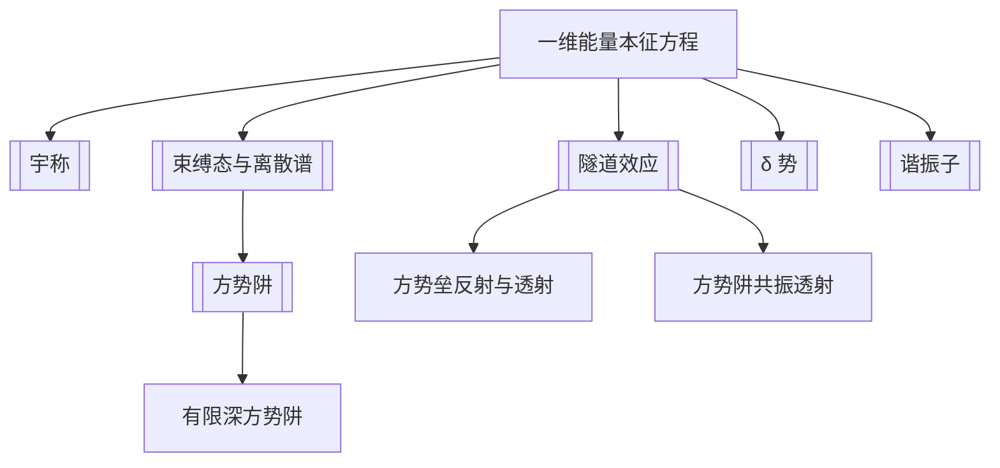

# 第2章 一维势场中的粒子

## 章节定位

第 2 章把第 1 章的 [[Schrodinger 方程]] 落到一维可计算模型中。核心问题是：

- 边界条件如何让能量离散化？
- 势垒/势阱散射中反射、透射和共振从哪里来？
- 奇异势（$\delta$ 势）如何改变波函数导数连续性？
- [[谐振子]] 为什么有零点能和等间距能级？

## 章节地图

## 目录结构

- 2.1 一维势场中粒子能量本征态的一般性质
  - 实势下可取实解
  - 对称势下本征态可取确定 [[宇称]]
  - 阶梯形有限势下 $\psi,\psi'$ 连续
  - 一维规则势场束缚态通常不简并
- 2.2 [[方势阱]]
  - 2.2.1 无限深方势阱、离散谱
  - 2.2.2 有限深对称方势阱
  - 2.2.3 [[束缚态与离散谱]]
  - 2.2.4 方势垒的反射与透射
  - 2.2.5 方势阱的反射、透射与共振
- 2.3 $\delta$ 势
  - 2.3.1 $\delta$ 势穿透
  - 2.3.2 $\delta$ 势阱束缚态
  - 2.3.3 $\delta$ 势与方势极限；导数跃变条件
- 2.4 [[谐振子]]
  - Hermite 多项式解
  - 等间距能级
  - 零点能与基态 Gaussian 分布

## 核心公式

| 模型 | 公式 | 说明 |
|---|---|---|
| 一维定态方程 | $\left[-\frac{\hbar^2}{2m}\frac{d^2}{dx^2}+V(x)\right]\psi=E\psi$ | 本章所有模型的共同起点 |
| 无限深方势阱 | $E_n=\frac{n^2\pi^2\hbar^2}{2ma^2}$ | 边界 $\psi(0)=\psi(a)=0$ 导致离散谱 |
| 无限深方势阱本征态 | $\psi_n(x)=\sqrt{2/a}\sin(n\pi x/a)$ | $0<x<a$ |
| 方势垒透射 | $T=|S|^2$ | 由入射、反射、透射波的概率流比值定义 |
| 共振透射条件 | $k'a=n\pi$ | 方势阱中相干叠加导致 $T=1$ |
| $\delta$ 势导数跃变 | $\psi'(0^+)-\psi'(0^-)=\frac{2m\gamma}{\hbar^2}\psi(0)$ | $V(x)=\gamma\delta(x)$ |
| $\delta$ 势阱束缚能 | $E=-\frac{m\gamma^2}{2\hbar^2}$ | $V(x)=-\gamma\delta(x),\gamma>0$ 只有一个偶宇称束缚态 |
| 谐振子能级 | $E_n=(n+\frac12)\hbar\omega$ | 等间距，有零点能 |
| 谐振子本征态 | $\psi_n(x)=A_ne^{-\alpha^2x^2/2}H_n(\alpha x)$ | $\alpha=\sqrt{m\omega/\hbar}$ |

## 模型对比

| 模型 | 边界/连接条件 | 能谱 | 物理关键词 |
|---|---|---|---|
| 无限深方势阱 | 阱壁波函数为 0 | 离散 | 量子化、节点、零点能 |
| 有限深方势阱 | $\psi,\psi'$ 连续 | 有限个束缚态 + 连续谱 | 穿透经典禁区 |
| 方势垒 | 三段平面波/指数波连接 | 连续 | 反射、透射、[[隧道效应]] |
| 方势阱散射 | 势阱内波长满足相位匹配 | 连续中的共振 | 共振透射 |
| $\delta$ 势 | $\psi$ 连续，$\psi'$ 跃变 | 吸引势有一个束缚态 | 短程作用极限 |
| 谐振子 | 无穷远平方可积 | 离散且等间距 | 零点能、Hermite 多项式 |

## 可计算模型

- 无限深势阱能级与本征态：![[infinite_well_levels.png]]
- 谐振子前几个定态：![[harmonic_oscillator_states.png]]
- 势垒透射随能量变化：见 ![[quantum_models_overview.png]]
- 代码入口：[[quantum_models.py]]

## 习题分类

| 题号 | 类型 | 目标 |
|---|---|---|
| 2.1 | 三维盒中粒子 | 分离变量，讨论简并 |
| 2.2-2.5 | 无限深方势阱 | 展开、突变、能量测量概率 |
| 2.6 | 势阱散射 | 计算反射与透射系数 |
| 2.7-2.10 | 谐振子 | Hermite 递推、平均值、涨落、外场平移 |
| 2.11 | 特殊势阱 | 分段求解能级 |
| 2.12 | 非定态叠加 | 时间演化、能量涨落、特征时间 |
| 2.13-2.16 | 选做 | 半壁无限高势、非对称势阱、[[相干态]]、最小不确定波包 |

## 下一步精读

- [ ] 校对 2.2.2 有限深方势阱的超越方程。
- [ ] 把方势垒透射系数补成独立代码图。
- [ ] 为 $\delta$ 势写一个数值/解析对照模型。
- [ ] OCR 第 3 章，整理算符代数与厄米算符。
