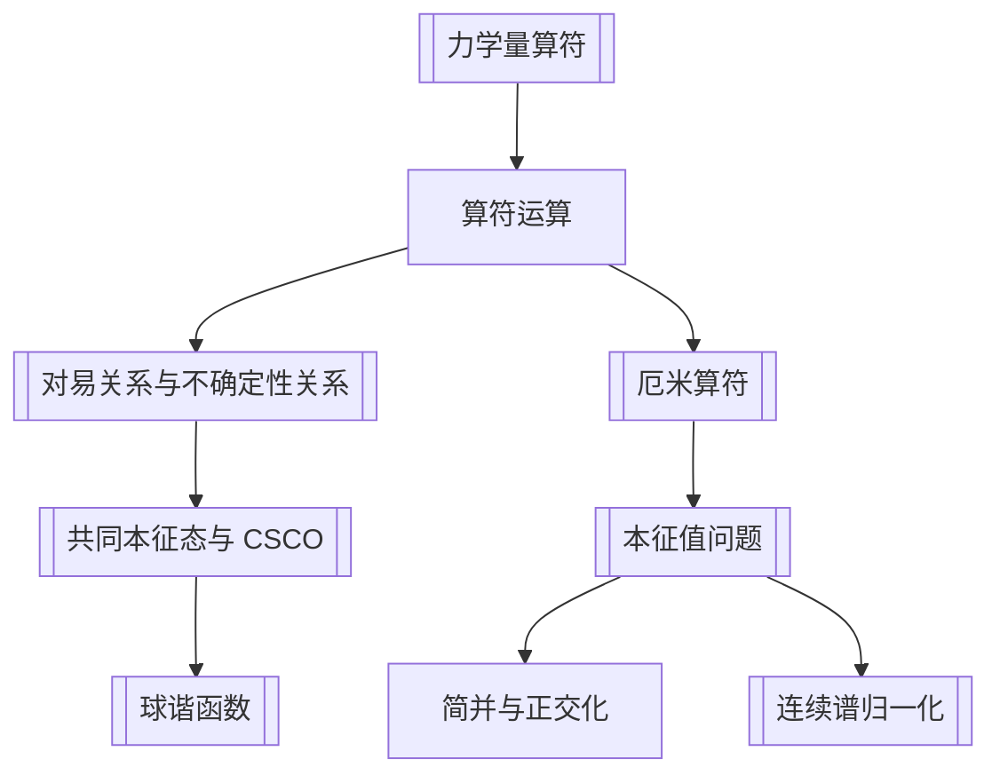

# 第3章 力学量用算符表达

## 章节定位

第 3 章把第 1 章引入的 [[力学量算符]] 系统化：可观测量由线性 [[厄米算符]] 表示，测量值是算符本征值，量子态可按一组完备共同本征态展开。它也是后续角动量、表象变换、自旋和微扰论的代数基础。

## 目录结构

- 3.1 算符的运算规则
  - 线性算符、单位算符、算符和与积
  - 基本对易关系 $[x_\alpha,p_\beta]=i\hbar\delta_{\alpha\beta}$
  - 角动量算符及其对易关系
  - 逆算符、算符函数、转置、复共轭、伴随与 [[厄米算符]]
- 3.2 [[本征值问题]]
  - 厄米算符本征值为实数
  - 不同本征值的本征函数正交
  - 角动量 $L_z$、平面转子、动量、自由粒子能量本征态
  - 简并态与 Schmidt 正交化
- 3.3 共同本征函数
  - [[对易关系与不确定性关系]] 的严格证明
  - $L^2,L_z$ 的共同本征态与 [[球谐函数]]
  - [[共同本征态与 CSCO]]
  - 力学量用厄米算符表达的基本假定
- 3.4 [[连续谱归一化]]
  - 连续谱本征函数不能通常归一化
  - Dirac $\delta$ 函数归一化
  - 箱归一化

## 核心公式

| 主题 | 公式 | 含义 |
|---|---|---|
| 对易子 | $[\hat A,\hat B]=\hat A\hat B-\hat B\hat A$ | 算符乘法一般不可交换 |
| 基本对易关系 | $[\hat x_\alpha,\hat p_\beta]=i\hbar\delta_{\alpha\beta}$ | 量子运动学基础 |
| 角动量 | $\hat{\mathbf L}=\mathbf r\times\hat{\mathbf p}$ | 轨道角动量算符 |
| 角动量代数 | $[\hat L_\alpha,\hat L_\beta]=i\hbar\epsilon_{\alpha\beta\gamma}\hat L_\gamma$ | 后续角动量理论基础 |
| 厄米条件 | $(\phi,\hat A\psi)=(\hat A\phi,\psi)$ | 可观测量算符条件 |
| 本征方程 | $\hat A\psi_n=a_n\psi_n$ | 测量 $A$ 的确定态 |
| 不确定度关系 | $\Delta A\,\Delta B\ge \frac12|\langle[\hat A,\hat B]\rangle|$ | 涨落的代数下界 |
| 球谐函数 | $\hat L^2Y_l^m=\hbar^2l(l+1)Y_l^m,\ \hat L_zY_l^m=\hbar mY_l^m$ | $L^2,L_z$ 共同本征函数 |
| 连续谱归一化 | $(\psi_p,\psi_{p'})=\delta(p-p')$ | 广义本征态归一化 |
| 箱归一化 | $p_n=2\pi n\hbar/L$ | 先离散化，再取 $L\to\infty$ |

## 本章结论

- 可观测量必须由线性厄米算符表示；这与测量值为实数相匹配。
- 当体系处于 $\hat A$ 的本征态时，测量 $A$ 无涨落。
- 厄米算符不同本征值的本征函数正交；简并子空间内仍需选取合适正交基。
- 两个可观测量是否能同时确定，与共同本征态和对易关系有关；但“有某些共同本征态”和“完全对易”不是同一句话。
- 一组 [[共同本征态与 CSCO]] 可以唯一标记态，是制备和展开量子态的标准语言。
- 连续谱本征态不能普通归一化，需要 Dirac $\delta$ 归一化或箱归一化。

## 可计算模型

- 算符代数验证：[[operator_algebra.py]]
- 内容：Pauli 矩阵厄米性、$[S_x,S_y]=iS_z$、自旋 $1/2$ 态中的不确定度关系。

## 习题分类

| 题号 | 类型 | 目标 |
|---|---|---|
| 3.1-3.4 | 算符代数 | 构造厄米/反厄米部分，熟悉对易和反对易恒等式 |
| 3.5-3.8 | 矢量算符与角动量 | 用 Levi-Civita 符号推导角动量代数 |
| 3.10 | 径向动量 | 理解球坐标中厄米性对算符形式的约束 |
| 3.11 | 不确定度估算 | 用不确定度关系估算谐振子基态能量 |
| 3.12-3.14 | 本征态平均值 | 离散能量本征态、角动量本征态中的平均值 |
| 3.15-3.16 | 球谐态测量 | 计算 $L^2,L_z,L_x$ 的测值和概率 |
| 3.17-3.18 | 选做算符公式 | Baker-Hausdorff 公式与相似变换 |

## 下一步精读

- [ ] 校对角动量在球坐标中的表达式。
- [ ] 为 CSCO 补一个“如何选择好量子数”的专题笔记。
- [ ] 将 3.11 谐振子基态能量估算写成题型卡。
- [ ] OCR 第 4 章，整理时间演化、守恒量和对称性。
