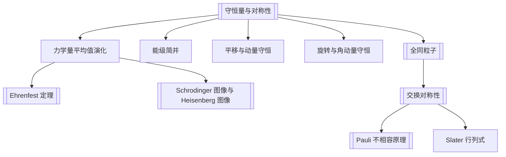

# 第4章 力学量随时间的演化与对称性

## 章节定位

本章回答两个问题：

- 力学量的平均值和概率分布如何随时间变？
- 对称性如何决定守恒量、简并和全同粒子的波函数结构？

## 目录结构

- 4.1 力学量随时间的演化
  - 4.1.1 [[守恒量与对称性|守恒量]]
  - 4.1.2 能级简并与守恒量的关系
  - 位力定理
- 4.2 [[Ehrenfest 定理]]
- 4.3 [[Schrodinger 图像与 Heisenberg 图像]]
- 4.4 [[守恒量与对称性]] 的关系
  - 平移不变性与动量守恒
  - 旋转不变性与角动量守恒
- 4.5 [[全同粒子]] 体系与波函数的 [[交换对称性]]
  - 两个全同粒子
  - $N$ 个 Fermi 子与 Slater 行列式
  - $N$ 个 Bose 子与占有数表象入口

## 核心公式

| 主题 | 公式 | 含义 |
|---|---|---|
| 平均值演化 | $\frac{d\langle A\rangle}{dt}=\frac{1}{i\hbar}\langle[A,H]\rangle+\left\langle\frac{\partial A}{\partial t}\right\rangle$ | Schrodinger 图像中的平均值演化 |
| 守恒量条件 | $[A,H]=0,\ \partial A/\partial t=0$ | 平均值和测值概率分布不随时间变 |
| Ehrenfest 定理 | $\frac{d\langle r\rangle}{dt}=\langle p\rangle/m,\ \frac{d\langle p\rangle}{dt}=-\langle\nabla V\rangle$ | 量子平均值与经典方程的联系 |
| 演化算符 | $U(t,0)=e^{-iHt/\hbar}$ | Hamilton 量不显含时的时间演化 |
| Heisenberg 算符 | $A_H(t)=U^\dagger(t,0)A_SU(t,0)$ | 把时间演化转移到算符上 |
| Heisenberg 方程 | $\frac{dA_H}{dt}=\frac{1}{i\hbar}[A_H,H]$ | 算符随时间演化 |
| 对称性变换 | $[Q,H]=0$ | Hamilton 量在变换 $Q$ 下不变 |
| 无穷小变换守恒量 | $Q=I+i\epsilon F,\ [F,H]=0$ | 连续对称性对应守恒量 |
| 交换算符 | $P_{ij}\psi=\pm\psi$ | 全同粒子波函数对称/反对称 |
| Slater 行列式 | $\psi_A=\frac{1}{\sqrt{N!}}\det[\phi_{k_a}(q_b)]$ | $N$ 个 Fermi 子的反对称态 |

## 概念澄清

- “守恒量”不等于“体系一定处于该力学量本征态”。守恒是概率分布和平均值不随时间变。
- “定态”是能量本征态；定态下不显含时间的力学量概率分布不变，但非定态中也可能有某些守恒量。
- 体系对称性通常带来守恒量，也常解释能级简并。
- 全同粒子的交换对称性不是人为规定的标签问题，而会影响可观测概率分布。
- Bose 子取完全对称波函数；Fermi 子取完全反对称波函数。

## 可计算模型

- 全同粒子相对距离概率分布：[[identical_particles.py]]
- 图像：![[identical_particle_exchange.png]]

## 习题分类

| 题号 | 类型 | 目标 |
|---|---|---|
| 4.1 | 概念判断 | 区分定态、守恒量、本征态和简并 |
| 4.2-4.3 | 计数问题 | 统计 Bose、Fermi、不同粒子可用态数 |
| 4.4-4.5 | 守恒量推导 | 使用对易关系判断平均值是否不变 |
| 4.6 | 平移算符 | 证明 Bloch 型波函数是平移算符本征态 |
| 4.7 | Feynman-Hellmann 定理 | 参数依赖 Hamilton 量的能级导数 |
| 4.8-4.10 | 能量表象求和规则 | 在 CSCCO 基下处理时间演化和求和规则 |

## 下一步精读

- [ ] 校对位力定理和 Feynman-Hellmann 定理公式。
- [ ] 为 4.2、4.3 写组合计数题型卡。
- [ ] 把全同粒子与第 8 章自旋统计关系连接起来。
- [ ] OCR 第 5 章，整理中心力场与氢原子。

