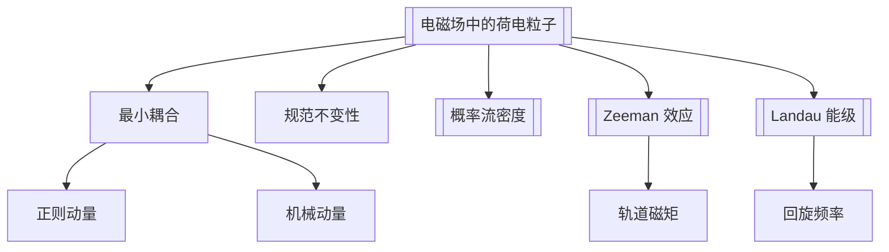

# 第6章 电磁场中粒子的运动

## 章节定位

本章把外电磁场引入 Schrodinger 方程。关键不是简单给势能加一项，而是用最小耦合替换正则动量，并区分正则动量、机械动量和 [[规范不变性|规范不变]] 的物理量。

## 目录结构

- 6.1 [[电磁场中的荷电粒子]]
  - 经典 Hamilton 量与 Lorentz 力
  - 正则动量 $\mathbf p$ 与机械动量 $\boldsymbol\pi=\mathbf p-\frac{q}{c}\mathbf A$
  - 电磁场中的 Schrodinger 方程
  - 定域概率守恒与规范不变性
- 6.2 [[Zeeman 效应|正常 Zeeman 效应]]
  - 均匀弱磁场中的矢势选择
  - 轨道磁矩与外磁场耦合
  - 中心场能级的 $m$ 简并被解除
- 6.3 [[Landau 能级]]
  - 自由电子在均匀磁场中的量子化
  - 对称规范与 Landau 规范
  - 回旋频率、无限简并和量子 Hall 效应入口

## 核心公式

| 主题 | 公式 | 含义 |
|---|---|---|
| 最小耦合 Hamilton 量 | $\hat H=\frac{1}{2\mu}\left(\hat{\mathbf p}-\frac{q}{c}\mathbf A\right)^2+q\phi$ | 电磁场中荷电粒子的量子 Hamilton 量 |
| 机械动量 | $\boldsymbol\pi=\hat{\mathbf p}-\frac{q}{c}\mathbf A$ | 与速度相关的动量，$\hat{\mathbf v}=\boldsymbol\pi/\mu$ |
| 正则动量 | $\hat{\mathbf p}=-i\hbar\nabla$ | 坐标表象中平移生成元，不等于机械动量 |
| 电磁场 | $\mathbf E=-\nabla\phi-\frac{1}{c}\partial_t\mathbf A,\quad \mathbf B=\nabla\times\mathbf A$ | 势并非唯一，场才直接规范不变 |
| 电磁概率流 | $\mathbf j=\operatorname{Re}\left[\psi^*\frac{1}{\mu}\left(-i\hbar\nabla-\frac{q}{c}\mathbf A\right)\psi\right]$ | 满足 $\partial_t\rho+\nabla\cdot\mathbf j=0$ |
| 规范变换 | $\mathbf A'=\mathbf A+\nabla\chi,\quad \phi'=\phi-\frac{1}{c}\partial_t\chi,\quad \psi'=e^{iq\chi/\hbar c}\psi$ | Schrodinger 方程形式不变 |
| 均匀磁场矢势 | $\mathbf A=\frac12\mathbf B\times\mathbf r$ | 对称规范 |
| 正常 Zeeman shift | $\Delta E=m\hbar\omega_L,\quad \omega_L=\frac{eB}{2\mu c}$ | 不计自旋时的轨道 Zeeman 分裂 |
| 轨道磁矩 | $\boldsymbol\mu_L=-\frac{e}{2\mu c}\mathbf L$ | 电子轨道角动量对应磁矩 |
| Landau 能级 | $E_n=\left(n+\frac12\right)\hbar\omega_c,\quad \omega_c=\frac{eB}{\mu c}$ | 自由电子垂直磁场平面运动的离散能级 |
| 有限面积简并度 | $g=\frac{eBS}{hc}$ | 面积 $S$ 中每个 Landau 能级的简并数 |

## 概念澄清

- 正则动量 $\mathbf p$ 是量子化时替换为 $-i\hbar\nabla$ 的变量；机械动量 $\boldsymbol\pi$ 才直接对应 $\mu\mathbf v$。
- 矢势 $\mathbf A$ 可以通过规范变换改变，但 $\mathbf E,\mathbf B,\rho,\mathbf j$ 等物理量不变。
- 正常 Zeeman 效应只考虑轨道磁矩；包含电子自旋后进入第 8 章的反常 Zeeman 效应。
- Zeeman 效应中原子束缚电子的 $B^2$ 反磁项通常可忽略；Landau 能级讨论自由电子时必须保留。
- Landau 能级离散并不表示粒子被空间束缚；简并中心可以在平面上连续移动。

## 可计算模型

- 电磁场模型：[[electromagnetic_particles.py]]
- 正常 Zeeman 分裂：![[zeeman_splitting.png]]
- Landau 能级：![[landau_levels.png]]

## 习题分类

| 题号 | 类型 | 目标 |
|---|---|---|
| 6.1 | 速度算符对易关系 | 从机械动量对易关系得到 Lorentz 力形式 |
| 6.2 | Landau 能级代数解 | 构造正则变量，把平面运动化为谐振子 |
| 6.3 | 交叉电磁场 | 在 Landau 规范下完成平方，求横向漂移修正后的能谱 |
| 6.4 | 磁场中的二维谐振子 | 分析束缚势与磁场共同作用下的能级和简并变化 |

## 下一步精读

- [ ] 校对规范变换中相位因子的符号和单位制。
- [ ] 补一张“正则动量 vs 机械动量”的题型卡。
- [ ] 将正常 Zeeman 效应与第 8 章自旋磁矩、反常 Zeeman 效应连接起来。
- [x] OCR 第 7 章，整理矩阵形式与表象变换。
