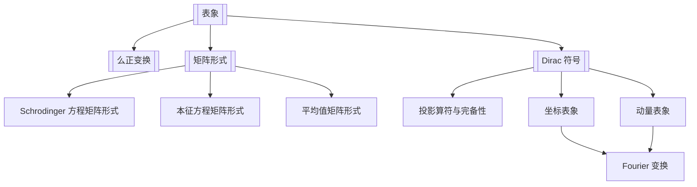

# 第7章 量子力学的矩阵形式与表象变换

## 章节定位

本章把前面以波函数和微分算符写出的量子力学，改写成抽象态矢、基矢展开和矩阵运算。核心思想是：物理态和算符本身不依赖表象，变的是它们在某组完备基下的分量和矩阵元。

## 目录结构

- 7.1 量子态的不同 [[表象]] 与 [[么正变换]]
  - 离散完备基中的态矢展开
  - 表象变换矩阵 $S_{\alpha k}=(\phi_\alpha,\psi_k)$
- 7.2 力学量算符的矩阵表示
  - 矩阵元 $L_{jk}=(\psi_j,L\psi_k)$
  - 算符矩阵的表象变换
  - 谐振子 $x,p,H$ 在能量表象中的矩阵
- 7.3 量子力学的 [[矩阵形式]]
  - Schrodinger 方程
  - 平均值
  - 本征方程
- 7.4 [[Dirac 符号]]
  - ket、bra、内积
  - 态与算符在具体表象中的表示
  - 坐标表象与动量表象

## 核心公式

| 主题 | 公式 | 含义 |
|---|---|---|
| 态矢展开 | $|\psi\rangle=\sum_k a_k|k\rangle,\quad a_k=\langle k|\psi\rangle$ | 态在某表象中的列矢分量 |
| 完备性 | $\sum_k |k\rangle\langle k|=I$ | 离散完备正交归一基 |
| 表象变换 | $a'_\alpha=\sum_k S_{\alpha k}a_k,\quad S_{\alpha k}=\langle \alpha|k\rangle$ | 同一态在两组基中的分量关系 |
| 么正性 | $S^\dagger S=SS^\dagger=I$ | 保证内积和概率不变 |
| 算符矩阵元 | $L_{jk}=\langle j|\hat L|k\rangle$ | 算符在表象中的矩阵 |
| 算符变换 | $L'=SLS^\dagger$ | 同一算符在新表象中的矩阵 |
| Schrodinger 方程 | $i\hbar\dot a_j=\sum_k H_{jk}a_k$ | 矩阵形式的时间演化 |
| 平均值 | $\langle L\rangle=a^\dagger L a$ | 列矢与矩阵计算平均值 |
| 本征方程 | $\sum_k L_{jk}c_k=\lambda c_j$ | 算符本征值问题化为矩阵本征值问题 |
| 坐标表象 | $\psi(x)=\langle x|\psi\rangle$ | 态在 $|x\rangle$ 基下的分量 |
| 动量表象 | $\phi(p)=\langle p|\psi\rangle$ | 态在 $|p\rangle$ 基下的分量 |
| Fourier 核 | $\langle x|p\rangle=(2\pi\hbar)^{-1/2}e^{ipx/\hbar}$ | 坐标表象与动量表象的变换核 |

## 概念澄清

- “态矢”是抽象对象；波函数只是它在坐标表象中的分量。
- “算符”也是抽象对象；矩阵只是它在某组基下的矩阵元。
- 表象变换不是物理变化，而是基的变化；内积、概率和本征值不变。
- 离散表象用求和与 Kronecker $\delta$；连续表象用积分与 Dirac $\delta$。
- 选择某个力学量完全集的共同本征态作为基，等价于选择一种表象。

## 可计算模型

- 表象变换模型：[[representation_transform.py]]
- 么正表象变换示意：![[unitary_basis_transform.png]]
- 谐振子矩阵元：![[harmonic_oscillator_matrices.png]]

## 习题分类

| 题号 | 类型 | 目标 |
|---|---|---|
| 7.1-7.2 | 抽象矩阵代数 | 从对易/反对易关系推出算符矩阵结构 |
| 7.3-7.5 | 坐标与动量表象矩阵元 | 推导 $x,p,H$ 的连续表象矩阵元 |
| 7.6 | 完备性与谱分解 | 用能量本征态展开 Hamilton 算符 |
| 7.7-7.8 | 二态体系 | 把二能级 Hamilton 量写成矩阵并类比自旋 $1/2$ |
| 7.9 | 能量表象 | 在能量表象中推导算符矩阵元随时间演化 |

## 下一步精读

- [ ] 为坐标/动量连续表象单独写一张 Fourier 变换题型卡。
- [ ] 校对 $L'=SLS^\dagger$ 的表象变换方向，避免与 $a'=Sa$ 混淆。
- [ ] 把二态体系连接到第 8 章 Pauli 矩阵和第 11 章二能级跃迁。
