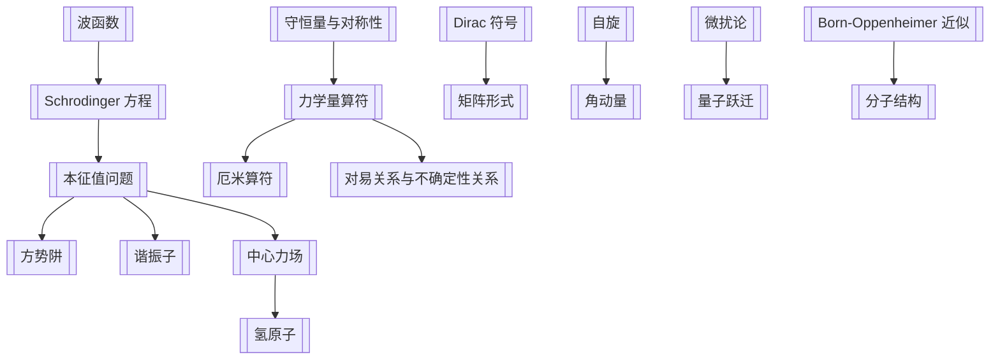

# 量子力学教程（曾谨言）知识地图

> [!info] 来源状态
> 该 PDF 是扫描版，已按章节生成 OCR 工作底稿并完成第 1-12 章第一轮整理。OCR 文本仍需人工校对，公式、上下标和表格最容易出错。主教材页码与 PDF 页码约满足：`PDF 页码 = 教材页码 + 31`。

## 核心主题

- [[波函数]]、[[Schrodinger 方程]] 与概率诠释
- 一维与中心势场中的本征值问题：[[方势阱]]、[[谐振子]]、[[中心力场]]
- [[力学量算符]]、[[对易关系与不确定性关系]]、[[守恒量与对称性]]
- 表象与矩阵形式：[[Dirac 符号]]、表象变换、角动量代数
- 近似与跃迁：[[微扰论]]、[[量子跃迁]]、[[Born-Oppenheimer 近似]]

## 章节结构

| 章 | 标题 | 教材页 | PDF 页 | 主线 |
|---|---|---:|---:|---|
| 1 | [[第1章 波函数与 Schrodinger 方程]] | 1 | 32 | [[波函数]]、[[Born 概率诠释]]、[[Schrodinger 方程]]、[[态叠加与测量]] |
| 2 | [[第2章 一维势场中的粒子]] | 27 | 58 | [[方势阱]]、[[隧道效应]]、[[δ 势|$\delta$ 势]]、[[谐振子]] |
| 3 | [[第3章 力学量用算符表达]] | 53 | 84 | [[力学量算符]]、[[厄米算符]]、[[本征值问题]]、[[共同本征态与 CSCO]] |
| 4 | [[第4章 力学量随时间的演化与对称性]] | 77 | 108 | [[守恒量与对称性]]、[[Ehrenfest 定理]]、[[Schrodinger 图像与 Heisenberg 图像]]、[[全同粒子]] |
| 5 | [[第5章 中心力场]] | 97 | 128 | [[中心力场]]、角动量、三维谐振子、[[氢原子]] |
| 6 | [[第6章 电磁场中粒子的运动]] | 118 | 149 | [[电磁场中的荷电粒子]]、[[Zeeman 效应]]、[[Landau 能级]] |
| 7 | [[第7章 量子力学的矩阵形式与表象变换]] | 128 | 159 | [[矩阵形式]]、[[Dirac 符号]]、[[表象]]、[[么正变换]] |
| 8 | [[第8章 自旋]] | 145 | 176 | [[自旋]]、Pauli 矩阵、总角动量、纠缠 |
| 9 | [[第9章 力学量本征值问题的代数解法]] | 170 | 201 | 谐振子因式分解、[[角动量耦合]]、[[Clebsch-Gordan 系数]] |
| 10 | [[第10章 微扰论]] | 183 | 214 | [[微扰论]]、散射态微扰、Born 近似 |
| 11 | [[第11章 量子跃迁]] | 203 | 234 | [[量子跃迁]]、周期微扰、半经典辐射理论 |
| 12 | [[第12章 其他近似方法]] | 228 | 259 | [[Fermi 气体模型]]、[[变分法]]、[[Born-Oppenheimer 近似]]、[[分子结构]] |

## 数学附录

- 波包与 Fourier 分析
- $\delta$ 函数
- Hermite 多项式
- Legendre 多项式与球谐函数
- 合流超几何函数
- Bessel 函数
- 自然单位

## 概念网络

## 可计算模型入口

- 代码：[[quantum_models.py]]
- 总览图：![[quantum_models_overview.png]]
- 势阱能级：![[infinite_well_levels.png]]
- 谐振子本征态：![[harmonic_oscillator_states.png]]
- 中心势有效势：![[central_potential_effective.png]]
- 氢原子径向概率：![[hydrogen_radial_probabilities.png]]
- Zeeman 分裂：![[zeeman_splitting.png]]
- Landau 能级：![[landau_levels.png]]
- 么正表象变换：![[unitary_basis_transform.png]]
- 谐振子矩阵元：![[harmonic_oscillator_matrices.png]]
- 自旋进动：![[spin_precession.png]]
- 微扰避免交叉：![[avoided_crossing.png]]
- Fermi 黄金规则峰：![[fermi_golden_sinc.png]]
- Fermi 气体占据：![[fermi_occupation.png]]
- 分子有效势：![[molecular_effective_potential.png]]

## 学习推进

进度看板：[[量子力学教程（曾谨言）整理进度]]

1. 先把每章拆成“概念、公式、模型、题型”四列。
2. 概念进入 `obsidian/concepts/`，每个概念只回答一个问题。
3. 模型进入 `code/models/`，先实现无量纲版本，再补物理常数。
4. 图像进入 `results/plots/`，图像笔记反链到模型和概念。
5. 题型流程沉淀到 `skills/`，避免只留下答案。
