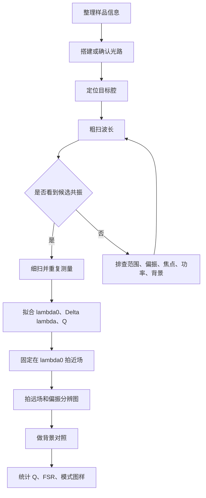
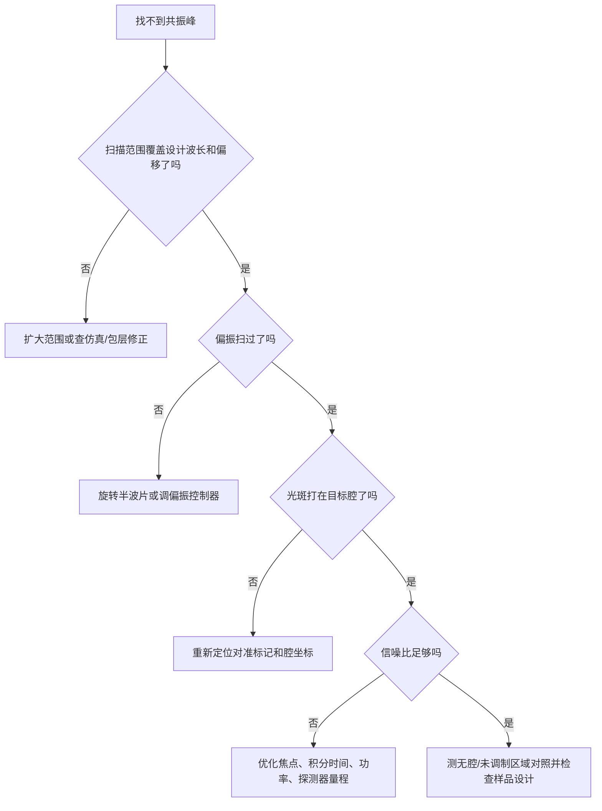

# 硅基狄拉克涡旋腔光学测试实验计划 1 - 交互式学习文档

> [!info] 使用方式
> 这份文档不是重复实验计划，而是把实验计划拆成“理解 - 决策 - 操作 - 判断 - 复盘”的学习流程。建议先折叠所有答案区，按顺序完成勾选、填空、判断和计算，再展开答案核对。

## 学习目标

完成本笔记后，应能独立回答四个问题：

- [ ] 为什么这个实验要同时看“光谱”和“场图”？
- [ ] 找不到共振峰时，应该先排查哪些变量？
- [ ] 如何从扫描谱中提取 $\lambda_0$、$\Delta\lambda$ 和 $Q$？
- [ ] 近场、远场和偏振分辨图各自支持什么结论？

> [!tip] 关联原计划
> 原始实验流程、设备表和风险表见 [[光学测试实验计划 1]]。本学习文档默认使用其中的实验设定：已制备硅基 Dirac-vortex cavity 样品，已有可调谐激光器，测试目标是先找共振、再拍模式、最后做统计。

## 0. 一句话抓主线

请先补全这句话：

> 这个实验的核心不是重新设计器件，而是用可调谐激光扫描找到设计波长附近的 ________，再固定在该波长拍摄 ________ 和 ________，最后统计不同样品的 $Q$ 与 FSR。

> [!success]- 参考答案
> 共振峰或共振谷；近场；远场。
>
> 更完整的说法：先用光谱确认有可拟合的腔模，再用空间图像确认模式局域在 vortex core，而不是来自普通散射或样品边缘。

## 1. 概念闯关

### 1.1 关键对象配对

把左侧概念和右侧作用连起来。

| 概念              | 你的答案 | 可选作用                                      |
| --------------- | ---- | ----------------------------------------- |
| $\lambda_0$     | C    | A. 共振线宽，用于计算 $Q$                          |
| $\Delta\lambda$ | B    | B. 相邻共振之间的波长间隔                            |
| $Q$             | D    | C. 共振中心波长                                 |
| FSR             | A    | D. 储能与损耗的综合指标，$Q=\lambda_0/\Delta\lambda$ |
| vortex core     | E    | E. 模式应局域的中心区域                             |
| far-field       | F    | F. 角分布或后焦面图样                              |

> [!success]- 参考答案
> $\lambda_0$ - C  
> $\Delta\lambda$ - A  
> $Q$ - D  
> FSR - B  
> vortex core - E  
> far-field - F

### 1.2 为什么只看光谱不够？

请选择最合理的一项：

- [ ] A. 因为光谱不能反映激光器是否工作。
- [ ] B. 因为任意样品散射都一定有高 $Q$ 共振。
- [x] C. 因为共振峰只能说明存在频率选择性响应，还不能证明模式局域在 vortex core 或具有预期远场特征。
- [ ] D. 因为 Dirac-vortex cavity 不需要测量 $Q$。

> [!success]- 参考答案
> C。  
> 这个实验需要“谱”和“场”共同成立：光谱给出 $\lambda_0$、$\Delta\lambda$、$Q$；近场确认局域；远场和偏振分辨图用于判断垂直出射、节点线、中心暗斑或矢量光束特征是否合理。

## 2. 实验地图

> [!question] 过程检查
> 如果还没有得到稳定可重复的 $\lambda_0$，是否应该直接拍远场？

> [!success]- 参考答案
> 不建议。远场图样应固定在明确的共振波长处拍摄；否则图像可能只是普通散射、背景反射或离共振信号。

## 3. 实验前准备清单

### 3.1 样品信息

进入实验室前，至少补齐下表。空项越多，后续“没测到”的解释空间越大。

| 项目 | 当前记录 | 是否确认 |
|---|---|---|
| chip 编号 / 区域编号 / 腔编号 |  | [ ] |
| 晶格常数 $a$ |  | [ ] |
| 调制参数 $\alpha$ |  | [ ] |
| 最大位移 $m_0$ |  | [ ] |
| 设计或仿真波长 |  | [ ] |
| 包层情况 |  | [ ] |
| 腔尺寸 $R$ 或直径 |  | [ ] |
| 目标模式 / winding number |  | [ ] |
| 显微镜坐标或对准标记 |  | [ ] |
| 仿真近场 / 远场参考图 |  | [ ] |

### 3.2 仪器确认

| 仪器 | 必问参数 | 当前答案 |
|---|---|---|
| 可调谐激光器 | 波长范围、最小步进、线宽、输出功率 |  |
| 物镜 | NA、工作距离、红外透过率 |  |
| 探测器 | 响应波段、噪声、饱和功率 |  |
| InGaAs 相机 | 响应波段、曝光时间、动态范围 |  |
| 偏振器件 | 是否覆盖目标波段、角度是否可标定 |  |
| 4f / 后焦面成像系统 | 焦距、是否可标定角度 |  |

> [!warning] 最容易漏掉的参数
> 激光器波长范围、相机响应波段、物镜 NA、样品前实际功率、偏振角、背景扫描位置。这些参数如果不记录，后期很难复现实验或解释异常。

## 4. 光谱测试互动流程

### 4.1 粗扫设置

请先填写：

- 设计中心波长：________ nm
- 粗扫范围：从 ________ nm 到 ________ nm
- 粗扫步进：________ nm
- 入射偏振角：________ 度
- 样品前功率：________ mW
- 探测通道：反射 / 透射 / 垂直散射 / 其他：________

> [!tip]- 设置原则
> 如果只有设计波长而没有工艺偏移信息，可先以设计波长为中心做较宽范围粗扫，例如 $\lambda_\mathrm{design}\pm20$ 到 $50\,\mathrm{nm}$。具体范围必须受激光器可调范围和样品设计限制。

### 4.2 细扫设置

粗扫看到候选峰后，回答：

- 候选共振波长：________ nm
- 预估线宽：________ nm
- 细扫范围：________ nm 到 ________ nm
- 细扫步进是否小于线宽的 $1/5$ 到 $1/10$？ [ ] 是 [ ] 否
- 重复扫描次数是否不少于 3 次？ [ ] 是 [ ] 否

> [!danger]- 如果细扫步进太粗
> $\Delta\lambda$ 会被采样误差放大或缩小，导致 $Q=\lambda_0/\Delta\lambda$ 不可信。若目标是拟合 $Q$，细扫比粗扫更关键。

### 4.3 线型判断

观察归一化后的谱线，选择拟合模型：

- [ ] 近似对称峰：Lorentzian 峰
- [ ] 近似对称谷：Lorentzian 谷
- [ ] 明显不对称：Fano 或 Fano/Lorentzian 对比
- [ ] 背景倾斜明显：先做背景扣除或低阶背景拟合

> [!example]- 拟合公式
> 共振峰：
> $$
> S(\lambda)=S_0 + A\frac{(\Delta\lambda/2)^2}{(\lambda-\lambda_0)^2+(\Delta\lambda/2)^2}
> $$
>
> 共振谷：
> $$
> S(\lambda)=S_0 - A\frac{(\Delta\lambda/2)^2}{(\lambda-\lambda_0)^2+(\Delta\lambda/2)^2}
> $$

## 5. 快速计算练习

### 5.1 Q 因子

已知某个共振谷拟合得到：

- $\lambda_0=1548.6\,\mathrm{nm}$
- $\Delta\lambda=0.18\,\mathrm{nm}$

请计算：

$$
Q=\frac{\lambda_0}{\Delta\lambda}=________
$$

> [!success]- 参考答案
> $Q=1548.6/0.18\approx8603$。  
> 可以报告为 $Q\approx8.6\times10^3$。如果拟合软件给出误差，还应同时报告不确定度。

### 5.2 FSR

同一个腔中测得三个相邻共振：

| 模式 | 波长 |
|---|---:|
| 1 | 1532.4 nm |
| 2 | 1548.6 nm |
| 3 | 1565.1 nm |

请计算：

- $\mathrm{FSR}_1=________$ nm
- $\mathrm{FSR}_2=________$ nm
- 平均 FSR $=________$ nm

> [!success]- 参考答案
> $\mathrm{FSR}_1=16.2\,\mathrm{nm}$  
> $\mathrm{FSR}_2=16.5\,\mathrm{nm}$  
> 平均 FSR $=16.35\,\mathrm{nm}$

### 5.3 背景扣除

成像时记录：

- 共振图：$I_\mathrm{on-res}$
- 离共振图：$I_\mathrm{off-res}$
- 暗场图：$I_\mathrm{dark}$

请选择更适合突出腔模的处理：

- [ ] A. 只看 $I_\mathrm{on-res}$
- [ ] B. 用 $I_\mathrm{on-res}-I_\mathrm{off-res}$
- [ ] C. 随机调亮相机显示范围

> [!success]- 参考答案
> B。  
> 更严谨时还要考虑暗场扣除，例如先对两张图都扣除 $I_\mathrm{dark}$，再做差分。

## 6. 成像测试互动流程

### 6.1 近场图像判断

拍到共振图后，逐项判断：

- [ ] 光斑是否集中在 vortex core 附近？
- [ ] 共振波长图像是否明显强于离共振图像？
- [ ] 是否排除了样品边缘、划痕、污染点的散射？
- [ ] 是否记录了曝光时间、增益、功率、偏振角？
- [ ] 是否有暗场图和离共振背景图？

> [!failure]- 不能作为强证据的情况
> 只有一张亮图，但没有离共振背景、没有样品定位图、没有确认光斑在 vortex core，也没有对应光谱共振。这种图最多说明有散射，不能单独说明测到了 Dirac-vortex cavity 模式。

### 6.2 远场图像判断

远场图应回答：

| 问题 | 你的观察 |
|---|---|
| 是否真的成像到物镜后焦面？ |  |
| 是否能标定角度或 NA 边界？ |  |
| 是否有中心暗斑、环形结构或节点线？ |  |
| 图样是否随分析偏振角规律变化？ |  |
| 是否与仿真 far-field 或论文预期一致？ |  |

> [!question]- 如果远场图样不清晰，优先改哪里？
> 先确认是否在后焦面，而不是样品面；再确认激光是否锁定在 $\lambda_0$；然后检查相机响应、曝光、背景扣除、光阑和偏振片角度。

## 7. 排错决策树

### 7.1 找不到共振峰

### 7.2 Q 值不稳定

| 现象 | 首要怀疑 | 处理动作 |
|---|---|---|
| 重复扫描中心波长漂移 | 热效应或环境漂移 | 降低功率，等待稳定，做功率依赖 |
| 拟合线宽忽大忽小 | 步进太粗或信噪比低 | 缩小步进，提高积分时间 |
| 线型不对称 | 干涉背景或耦合通道复杂 | 尝试 Fano 拟合并报告残差 |
| 峰值突然消失 | 对准漂移或样品损伤 | 回到低功率复测，拍显微图 |

## 8. 实验记录模板

### 8.1 单次光谱扫描记录

| 字段 | 记录 |
|---|---|
| 日期 |  |
| 操作者 |  |
| chip / 区域 / 腔编号 |  |
| $a$ / $\alpha$ / $m_0$ / $R$ |  |
| 包层情况 |  |
| 扫描范围 |  |
| 步进 / 积分时间 |  |
| 输入功率 / 样品前功率 |  |
| 偏振角 |  |
| 物镜 NA |  |
| 探测通道 |  |
| 背景文件 |  |
| 原始数据文件 |  |
| 异常现象 |  |

### 8.2 单个共振拟合记录

| 字段 | 记录 |
|---|---|
| 数据文件 |  |
| 背景扣除方法 |  |
| 拟合模型 | Lorentzian / Fano / 其他 |
| 拟合区间 |  |
| $\lambda_0$ |  |
| $\Delta\lambda$ |  |
| $Q$ |  |
| 拟合残差是否可接受 | [ ] 是 [ ] 否 |
| 备注 |  |

### 8.3 成像记录

| 字段 | 近场 | 远场 |
|---|---|---|
| 固定波长 |  |  |
| 是否为 $\lambda_0$ | [ ] | [ ] |
| 偏振角 |  |  |
| 输入功率 |  |  |
| 曝光 / 增益 |  |  |
| 背景图文件 |  |  |
| 原始图文件 |  |  |
| 是否看到 core 局域 / 远场结构 |  |  |

## 9. 判断题自测

请先作答，再展开答案。

1. 只要看到亮的近场光斑，就能证明测到了 Dirac-vortex cavity 模式。  
   你的判断：对 / 错

2. $Q$ 的计算要求 $\lambda_0$ 和 $\Delta\lambda$ 使用相同单位。  
   你的判断：对 / 错

3. 如果共振谷线型不对称，可以直接删除异常点让它看起来像 Lorentzian。  
   你的判断：对 / 错

4. 拍远场之前，应先通过光谱确定并固定在共振波长。  
   你的判断：对 / 错

5. 无腔区域、离共振波长和暗场背景都属于有用对照。  
   你的判断：对 / 错

> [!success]- 参考答案
> 1. 错。需要光谱、定位、背景对照共同支持。  
> 2. 对。  
> 3. 错。应换用更合理的线型、说明拟合区间并报告残差。  
> 4. 对。  
> 5. 对。

## 10. 实验前通关标准

全部勾选后，再进入正式测试。

- [ ] 已知道目标样品的设计波长或仿真共振波长。
- [ ] 已知道可调谐激光器覆盖范围和最小步进。
- [ ] 已确认探测器和相机覆盖目标波段。
- [ ] 已准备样品编号、腔编号和显微定位方式。
- [ ] 已确定至少一种可执行光谱通道：反射、透射或垂直散射。
- [ ] 已规划粗扫、细扫和重复扫描。
- [ ] 已规划无腔区域、离共振波长、暗场背景三类对照。
- [ ] 已准备记录偏振角、功率、物镜 NA、曝光和积分时间。
- [ ] 已明确拟合输出：$\lambda_0$、$\Delta\lambda$、$Q$、残差。
- [ ] 已明确最终统计：按样品参数整理 $Q$、FSR、近场、远场。

## 11. 最小可交付结果

如果实验时间有限，至少交付以下内容：

1. 一张代表性共振谱，包含原始数据、背景扣除或归一化方式、Lorentzian/Fano 拟合、$\lambda_0$、$\Delta\lambda$、$Q$。
2. 一组近场图：共振、离共振、背景扣除结果，并标注腔位置。
3. 一组远场图：共振 far-field、背景图；若有偏振分析，给出 $0^\circ$、$45^\circ$、$90^\circ$、$135^\circ$。
4. 一个样品统计表：样品编号、$a$、$\alpha$、$m_0$、$R$、包层、$\lambda_0$、$Q$、FSR、备注。
5. 一段结论：是否看到孤立共振、是否局域在 vortex core、远场是否与预期一致、主要不确定性是什么。

> [!abstract] 最后复述
> 这个实验的判断链条是：  
> **设计参数和样品定位可信** -> **光谱中有可重复共振** -> **拟合得到可信 $Q$** -> **近场局域在 vortex core** -> **远场/偏振图样支持设计模式** -> **跨样品统计 $Q$ 和 FSR**。

