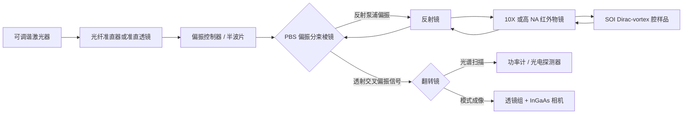
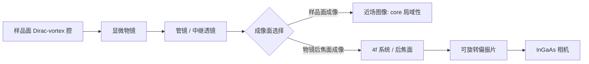
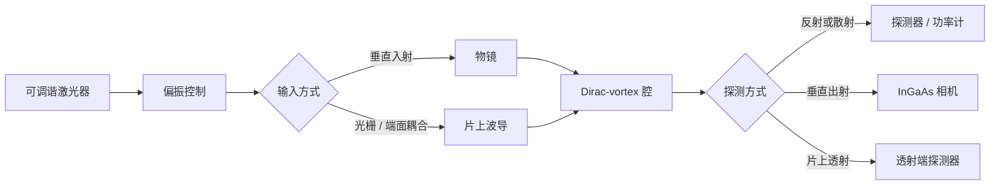

# 硅基狄拉克涡旋腔光学测试实验计划

## 论文中与实验测试相关的内容提取

论文的核心实验验证集中在 Fig. 5 和补充材料 Fig. S10-S12：作者测试了 silica-cladded SOI Dirac-vortex cavities，典型结构参数为 $\alpha=4$、$m_0=50\,\mathrm{nm}$、$a=490\,\mathrm{nm}$。SOI 样品采用 $220\,\mathrm{nm}$ silicon layer，并通过 electron-beam lithography 与 dry etching 制作空气孔图案；下方 $\mathrm{SiO_2}$ cladding 用于机械支撑。Fig. 5 的逻辑不是重新设计器件，而是围绕已经制备好的腔做三类光学表征：测共振光谱、拍偏振分辨 far-field 图样、统计不同 vortex size 下的 $Q$ 和 FSR。

对我们实验最重要的启发有七点。第一，可调谐激光可以作为波长扫描源，逐点扫过设计波长附近，通过 cross-polarized reflectivity、反射、透射或垂直散射信号得到共振峰或共振谷。第二，共振波长 $\lambda_0$ 和线宽 $\Delta\lambda$ 可由 Lorentzian 或 Fano/Lorentzian 线型拟合得到，并计算 $Q=\lambda_0/\Delta\lambda$。第三，在共振波长处固定激光，可以用显微物镜和红外相机观察腔区垂直出射的空间模式，包括近场光斑和后焦面远场。第四，Dirac-vortex cavity 的腔模特征需要同时看“谱”和“场”：是否存在孤立 mid-gap-like 共振、模式是否局域在 vortex core、远场是否与设计模式或仿真模式一致。第五，论文实验使用偏振分辨远场作为核心证据：在 cross-polarization setup 中，PBS 一方面分离泵浦和同波长样品出射信号，另一方面让相机看到经过分析偏振后的 far-field。第六，远场中零强度径向线的数量可作为矢量光束拓扑荷 $|l|$ 的实验判据之一。第七，silica-cladded SOI 结构说明该体系可以在有包层和高折射率基底相关平台上做被动光学测试，但实际耦合方式、扫描波段、探测器响应和相机型号需要根据实验室仪器确认。

本计划按“先复现实验判据，再适配本实验室仪器”的思路设计。主流程为：先找共振，再做 cross-polarized reflectivity 或等效反射谱，随后拍偏振分辨 far-field / near-field，最后统计 $Q$、FSR、拓扑荷判据和样品参数依赖。由于目前已知条件只有样品已制备、可调谐激光器已找到，下面所有功率、波长范围、步进、NA、探测器带宽和成像倍率均标注为需要根据实际仪器参数确认。

## 论文与 SI 中可直接采用的实验锚点

| 来源位置 | 可采用信息 | 对本实验计划的影响 |
|---|---|---|
| 主文 Fig. 5 | silica-cladded SOI Dirac-vortex cavities；$\alpha=4$、$m_0=50\,\mathrm{nm}$、$a=490\,\mathrm{nm}$ | 样品表和扫描计划优先围绕这些参数建立 |
| 主文 SOI experiments | $220\,\mathrm{nm}$ Si layer，electron-beam lithography，dry etching，underneath $\mathrm{SiO_2}$ cladding | 测试前需确认本样品硅层厚度、包层和刻蚀深度是否一致 |
| 主文 Fig. 5b 与 SI Fig. S10 | $w=+1,+2,+3$ 腔的光谱和远场；模式数与 winding number 对应 | 若样品含不同 $w$，应按 $w$ 分组记录共振数量与远场图样 |
| 主文 Fig. 5c-d | $Q$ 随 mode area 增大而提升并在 $10^4$ 到 $10^5$ 量级饱和；$2R=50\,\mu\mathrm{m}$ 腔实验 FSR 约 $8.22\,\mathrm{nm}$ | 可作为实验结果是否合理的量级参考，不作为硬性成功标准 |
| SI Fig. S2 | 同等模式面积下 Dirac-vortex cavity 的 FSR 明显大于 Fabry-Perot / ring | 数据分析要把 FSR 与 mode area 或 vortex diameter 放在同一图中 |
| SI Fig. S7 | $w=+1$ 的所有 cavity modes、far-field、X/Y polarization 和实验 $Q$ | 不能只记录一个峰；应扫描足够宽的范围以识别邻近 singlet/doublet modes |
| SI Fig. S11 | cross-polarized reflectivity setup：tunable laser、sample、10X objective、PBS、IR camera、power meter、flip mirror | 推荐优先搭建或等效实现交叉偏振反射测试光路 |
| SI Fig. S12 | $Q$ 与 $\lambda$ 随 $m_0$、$R$ 变化；小尺寸正 winding 腔波长较长 | 若测不同 $m_0$ 或 $R$，应同时记录 $\lambda_0$ 和 $Q$ 的趋势 |

## 1. 实验目的

本实验的目的不是重新设计狄拉克涡旋腔，而是对已制备的硅基 Dirac-vortex cavity 样品进行光学表征，验证其是否表现出论文中讨论的拓扑腔特征。

需要验证的内容包括：

1. 在设计波长附近是否存在清晰的光学共振模式。
2. 共振波长 $\lambda_0$、半高全宽 $\Delta\lambda$ 和品质因子 $Q$ 是否达到样品设计预期。
3. 腔模是否局域在 vortex core 区域，而不是来自样品边缘、随机缺陷或普通光子晶体背景散射。
4. 在共振波长处是否能观察到垂直出射信号，包括近场腔区光斑和远场角分布。
5. 若具备偏振分析条件，进一步判断出射模式是否具有涡旋光或矢量光束特征，例如偏振纹理、中心暗斑、远场节点线或与 winding number 相关的图样。
6. 对不同样品编号、腔尺寸、调制参数或包层情况，比较共振波长、$Q$、FSR 和模式图样差异。

## 2. 样品信息

测试前需要先整理样品表。没有这些信息，后续很难判断“没测到”是器件问题、波长范围问题，还是光路问题。

| 项目 | 需要记录的内容 | 目的 |
|---|---|---|
| 样品编号 | chip 编号、区域编号、腔编号 | 保证光谱和图像可追溯 |
| 晶格常数 $a$ | 例如论文 Fig. 5 中为 $a=490\,\mathrm{nm}$ | 估计设计共振波长和归一化频率 |
| 调制参数 $\alpha$ | 例如论文 Fig. 5 中为 $\alpha=4$ | 判断 Kekule/Dirac-vortex 调制强度 |
| 最大位移 $m_0$ | 例如论文 Fig. 5 中为 $m_0=50\,\mathrm{nm}$ | 判断带隙打开程度和腔模形成条件 |
| 设计波长 | 设计中心波长、仿真共振波长 | 设置可调谐激光扫描范围 |
| 包层情况 | air-clad、silica-cladded、上包层厚度 | 影响有效折射率、辐射损耗和共振偏移 |
| 腔尺寸 | $R$、$2R$、晶格周期数、物理直径 | 用于统计 $Q$、FSR 和模式面积 |
| 目标模式 | winding number $w$、目标简并数、TE-like 模 | 判断应看到几个共振和何种远场图样 |
| 版图位置 | 显微镜下坐标、对准标记位置 | 缩短实验室定位时间 |
| 仿真参考 | 频谱、近场、远场、$Q$、模式面积 | 后续做实验-仿真对比 |

## 3. 实验设备

基础设备清单如下，带“需要确认”的项目应在进实验室前问清型号和范围。

| 设备 | 用途 | 需要确认的参数 |
|---|---|---|
| 可调谐激光器 | 扫描共振波长，固定共振波长做成像 | 波长范围、最小步进、线宽、输出功率、扫描模式 |
| 偏振控制器 / 起偏器 / 半波片 | 调整入射偏振以匹配 TE-like 腔模 | 是否覆盖目标波段，是否可旋转标定角度 |
| 显微物镜 | 聚焦入射光并收集垂直散射/出射光 | NA、工作距离、红外透过率 |
| 三维位移台 | 样品定位和焦平面调节 | 最小步进、行程、是否有压电细调 |
| 红外相机 / InGaAs 相机 | 观察腔区近场、远场或出射光斑 | 响应波段、曝光时间、像素尺寸、动态范围 |
| 光电探测器 | 记录反射、透射或散射强度随波长变化 | 带宽、噪声等效功率、饱和功率 |
| 光谱采集系统或功率计 | 辅助记录光谱和光功率 | 是否能和激光波长同步记录 |
| CCD / InGaAs 相机 | 可见对准或近红外成像 | 若目标在 1550 nm 附近，优先 InGaAs |
| 偏振分束棱镜 PBS | 搭建 cross-polarized reflectivity 光路，分离泵浦和样品同波长信号 | 目标波段消光比、透射/反射方向、损伤阈值 |
| 分束镜 | 分离入射和收集光路 | 目标波段反射/透射比 |
| 翻转镜 flip mirror | 在功率计/探测器和红外相机之间切换 | 是否能保持光轴复现 |
| 透镜组 | 成像、扩束、傅里叶面投影 | 焦距、镀膜波段 |
| 滤光片 | 抑制背景光和泵浦杂散光 | 中心波长、带宽、OD |
| 光阑 | 限制背景散射，选择腔区信号 | 孔径和位置可调 |
| 偏振分析器 | 分析出射矢量光束偏振纹理 | 偏振片、半波片、四分之一波片是否可用 |

## 4. 光路方案与光路图

### 4.1 推荐主光路：交叉偏振反射光谱与远场成像

优先采用 SI Fig. S11 对应的 cross-polarized reflectivity setup。这个光路适合测试同一波长下的反射共振和垂直出射 far-field，关键元件是 PBS：泵浦光以一种线偏振入射到样品，样品返回光中与泵浦正交的偏振分量透过 PBS，被功率计、探测器或红外相机接收。

![[assets/硅基狄拉克涡旋腔交叉偏振反射光路.svg]]



简化的台面摆放草图如下：

```text
Tunable laser -> collimator -> HWP/PC -> PBS -> mirror -> objective -> sample
                                             ^
                                             |
                       detector / power meter <- flip mirror -> IR camera
```

> [!note] PBS 的作用
> PBS 不只是普通分光器。它同时完成两件事：一是把入射泵浦和样品返回信号按偏振分开，降低同偏振反射背景；二是让相机看到特定分析偏振下的 far-field，从而观察零强度径向线和偏振相关图样。

本方案的测试顺序为：先把翻转镜打到功率计或探测器通道，扫描可调谐激光获得交叉偏振反射谱；找到 $\lambda_0$ 后固定激光波长，再把翻转镜打到红外相机通道，拍摄共振波长 far-field 或 near-field。每次扫描必须记录：样品编号、腔编号、扫描起止波长、步进、积分时间、输入功率、泵浦偏振方向、PBS 方向、物镜 NA、探测通道、环境温度、是否做背景扣除。

### 4.2 近场 / 远场成像切换光路

同一个收集光路可以通过成像面切换来拍样品面近场或物镜后焦面远场。近场用于判断模式是否局域在 vortex core；远场用于判断角分布、节点线、中心暗斑、环形结构和拓扑荷相关图样。



近场测试重点看光斑是否集中在 vortex core 附近、是否随波长从离共振到共振显著增强。远场测试重点看出射角分布、零强度径向线数量、是否有环形或节点线结构，以及是否与仿真 far-field 一致。若有偏振分析器，应至少拍 $0^\circ$、$45^\circ$、$90^\circ$、$135^\circ$ 四个分析角；如果有半波片和四分之一波片，可进一步做 Stokes 参数或偏振椭圆分析。

每次成像必须记录：固定波长、泵浦偏振角、分析偏振角、输入功率、曝光时间、相机增益、焦面类型、滤光片、是否扣暗场、是否拍离共振背景图、是否有后焦面角度标定。

### 4.3 可选光路：普通反射、垂直散射或片上透射

如果实验台暂时没有合适 PBS，或者样品版图包含端面、波导、光栅耦合结构，可以采用普通反射、垂直散射或片上透射作为备选。备选光路的优先级低于交叉偏振反射，因为同偏振反射背景通常更强，远场偏振图样也更难直接解释。



无论采用哪种备选通道，都必须同时测无腔区域、未调制区域、离共振波长和不同偏振角下的背景。若备选通道只得到谱图而无法得到清晰 far-field，应在结论中明确其限制，不能把普通散射谱直接等同于 Dirac-vortex 矢量光束出射。

## 5. 实验步骤

1. 样品定位  
目的：找到目标 Dirac-vortex cavity，而不是测到相邻结构或随机缺陷。  
操作：用低倍物镜找到 chip 坐标和对准标记，再换高倍物镜定位目标腔。  
记录：样品编号、腔编号、显微图、坐标、物镜倍率、对焦高度。

2. 激光器波长范围设置  
目的：保证扫描覆盖设计共振和可能的工艺偏移。  
操作：以设计波长或仿真波长为中心，先用较宽范围粗扫，例如 $\lambda_\mathrm{design}\pm 20$ 到 $50\,\mathrm{nm}$，具体范围需要根据可调谐激光器确认。  
记录：起止波长、扫描步进、扫描速度、激光线宽。

3. 输入功率设置  
目的：避免信号太弱，同时避免热漂移和样品损伤。  
操作：从低功率开始，例如探测端可见信号但不饱和的最小功率；逐步增加并观察谱线是否红移或展宽。具体功率范围需要根据样品耐受功率和仪器确认。  
记录：激光器设定功率、样品前实测功率、探测器是否饱和、是否出现热漂移。

4. 偏振调节  
目的：提高 TE-like 腔模激发效率并排除偏振不匹配。  
操作：旋转半波片或偏振控制器，观察共振信号强度随偏振角变化。若采用交叉偏振反射光路，先调 PBS 前的泵浦偏振，使入射光主要走泵浦通道；再在 PBS 透射端观察交叉偏振背景，尽量降低无样品或无腔区域的背景。  
记录：泵浦偏振角、分析偏振角、PBS 方向、共振深度或峰值强度、最佳偏振条件。

5. PBS 和探测通道标定  
目的：确认功率计/探测器通道与红外相机通道采集的是同一返回光路，避免翻转镜切换后光轴偏移。  
操作：用无腔区域或反射较强区域调光路，分别记录翻转镜到功率计和相机时的光斑位置；检查 PBS 交叉偏振端是否能有效压低直接反射背景。  
记录：PBS 透射/反射方向、翻转镜两个位置的光斑图、无腔背景强度、偏振消光情况。

6. 波长扫描  
目的：找到共振峰/谷并获得可拟合的线型。  
操作：先粗扫定位候选峰，再围绕每个峰细扫。细扫步进应小于预期线宽的 1/5 到 1/10；若仪器允许，优先使用更小步进。  
记录：波长数组、探测器电压或功率、同步时间戳、偏振角、输入功率。

7. 记录光谱  
目的：得到可重复分析的原始谱。  
操作：每个腔至少重复扫描 3 次；同时在无腔区域、未调制光子晶体区域或离腔位置做背景扫描。  
记录：原始数据文件名、背景文件名、重复次数、异常漂移情况。

8. 拟合共振峰  
目的：提取 $\lambda_0$、$\Delta\lambda$ 和 $Q$。  
操作：对背景扣除或归一化后的谱线做 Lorentzian 拟合；若谱线明显不对称，则尝试 Fano 线型并注明。  
记录：拟合模型、初值、拟合区间、$\lambda_0$、$\Delta\lambda$、$Q$、拟合残差。

9. 固定共振波长拍摄近场  
目的：确认共振模式在腔区局域。  
操作：把激光固定在 $\lambda_0$，相机对准样品面拍摄腔区图像；再在离共振波长拍一张背景图。  
记录：共振图、离共振图、暗场图、曝光时间、增益、功率、焦面位置。

10. 拍摄远场和偏振分辨远场  
目的：判断垂直出射角分布和可能的矢量光束特征。  
操作：调整成像系统到物镜后焦面，固定 $\lambda_0$，拍摄 far-field；在相机前加入可旋转偏振片，至少采集 $0^\circ$、$45^\circ$、$90^\circ$、$135^\circ$ 四个分析角。若远场中出现零强度径向线，记录线数并与预期拓扑荷 $|l|$ 比较。  
记录：远场图、分析偏振角、相机标定、物镜 NA、零强度径向线数量、是否看到环形/节点线/中心暗斑。

11. 做背景对照  
目的：排除普通散射、边缘散射、反射干涉和相机背景。  
操作：测无腔区域、未调制区域、离共振波长、不同偏振角下的信号。  
记录：所有对照图和对照谱，并保持与正式测试相同功率和曝光条件。

12. 改变输入功率测试稳定性  
目的：判断共振是否受热效应、非线性或损伤影响。  
操作：在低、中、高三个功率点重复细扫，并记录 $\lambda_0$ 和 $\Delta\lambda$ 是否变化。  
记录：功率-$\lambda_0$ 曲线、功率-$Q$ 曲线、是否出现不可逆变化。

13. 改变样品参数做统计  
目的：复现论文中按 $w$、$R$、$m_0$ 统计模式数量、$Q$、FSR 和远场图样的逻辑。  
操作：优先测 $w=+1,+2,+3$ 或样品中已有的 winding number 系列；对每个 $w$ 记录共振数量和偏振分辨远场。若样品包含不同 $R$ 或 $m_0$，按参数递增顺序测量。  
记录：样品参数表、每个腔的 $\lambda_0$、$Q$、FSR、远场拓扑荷判读、异常样品备注。

## 6. 数据处理方法

### 共振波长 $\lambda_0$

对每个共振峰或谷做线型拟合，拟合中心即为 $\lambda_0$。若是反射谷或透射谷，先把谱线归一化为背景附近为 1，再拟合谷值位置。若谱线不对称，需要同时报告 Lorentzian 和 Fano 拟合结果，并说明采用哪个作为主结果。

### 半高全宽 $\Delta\lambda$

对 Lorentzian 线型，$\Delta\lambda$ 取 full width at half maximum。若是共振谷，使用半深度宽度；若背景倾斜明显，应先做线性或低阶多项式背景扣除。

### Q 因子

计算公式为：

$$
Q=\frac{\lambda_0}{\Delta\lambda}
$$

其中 $\lambda_0$ 和 $\Delta\lambda$ 必须使用相同单位。报告时同时给出拟合误差，例如 $Q=(1.2\pm0.1)\times10^4$。

### 自由光谱范围 FSR

若同一腔中能分辨多个相邻共振，则：

$$
\mathrm{FSR}_i = |\lambda_{i+1}-\lambda_i|
$$

对多个间隔取平均和标准差。论文强调 Dirac-vortex cavity 的 FSR 可在较大模式面积下仍保持较大，实验中可重点比较不同腔尺寸的 FSR。

### 模式面积或光斑尺寸

从近场图像中扣除暗场和离共振背景，得到强度分布 $I(x,y)$。可用二维 Gaussian 或二阶矩估计光斑尺寸：

$$
\sigma_x^2=\frac{\sum I(x,y)(x-\bar{x})^2}{\sum I(x,y)},\quad
\sigma_y^2=\frac{\sum I(x,y)(y-\bar{y})^2}{\sum I(x,y)}
$$

若模式不是 Gaussian，应报告等强度面积，例如 $I>0.5I_\mathrm{max}$ 的区域面积。相机像素到实际长度的标定需要根据物镜倍率和相机像素尺寸确认。

### 远场发散角

若拍摄物镜后焦面，需要先用物镜 NA 或标定样品把相机像素换算为空间频率或角度。近似关系为：

$$
\sin\theta \approx \frac{r}{f_\mathrm{obj}}
$$

实际处理时更建议用物镜 NA 标定视场边界：后焦面半径对应最大收集角 $\theta_\mathrm{max}=\arcsin(\mathrm{NA}/n)$。报告远场主瓣半角、环半径、发散角 FWHM，以及偏振片角度下图样变化。

### 偏振分辨远场与拓扑荷判读

论文主文和 SI 中使用经过水平偏振分析后的 far-field 图样来和数值结果比较。对本实验而言，偏振分辨图样不要只保存一张代表图，应按同一曝光和增益记录多个分析角。基本输出包括：

| 分析项 | 处理方法 | 判据 |
|---|---|---|
| 零强度径向线 | 对背景扣除后的 far-field 做强度归一化，人工或算法标出暗线 | 零强度径向线数量应与矢量光束拓扑荷 $|l|$ 的预期一致 |
| 偏振角依赖 | 比较 $0^\circ$、$45^\circ$、$90^\circ$、$135^\circ$ 的强度分布 | 图样应随分析偏振角规律旋转或重构，而不是随机变化 |
| 仿真对比 | 与 FDTD / FEM far-field 的 $|E_x|^2$、$|E_y|^2$ 或总强度比较 | 主瓣、暗线、对称性和角宽应大体一致 |
| 背景排除 | 比较共振、离共振、无腔区域和暗场图 | 只有共振波长显著出现的结构才可作为腔模证据 |

若只有总强度 far-field，而没有偏振分析，则可以报告垂直出射角分布，但不应强行给出拓扑荷结论。

### 背景扣除方法

推荐至少保留三类背景：

1. 暗场背景：激光关闭，相机曝光参数不变。
2. 离共振背景：激光打开但波长偏离 $\lambda_0$。
3. 空间背景：同一 chip 上无腔或远离腔区的位置。

图像处理可用：

$$
I_\mathrm{mode}=I_\mathrm{on-res}-I_\mathrm{off-res}
$$

光谱处理可用：

$$
S_\mathrm{norm}(\lambda)=\frac{S_\mathrm{cavity}(\lambda)-S_\mathrm{dark}}{S_\mathrm{background}(\lambda)-S_\mathrm{dark}}
$$

### Lorentzian 拟合方法

共振峰可用：

$$
S(\lambda)=S_0 + A\frac{(\Delta\lambda/2)^2}{(\lambda-\lambda_0)^2+(\Delta\lambda/2)^2}
$$

共振谷可用：

$$
S(\lambda)=S_0 - A\frac{(\Delta\lambda/2)^2}{(\lambda-\lambda_0)^2+(\Delta\lambda/2)^2}
$$

若线型有明显干涉背景，采用 Fano 形式：

$$
S(\lambda)=S_0 + A\frac{(q+\epsilon)^2}{1+\epsilon^2},\quad
\epsilon=\frac{2(\lambda-\lambda_0)}{\Delta\lambda}
$$

拟合时要保存原始数据、背景扣除数据、拟合脚本和残差图。

## 7. 预期结果

1. 在设计波长附近应出现明显共振峰或共振谷。由于加工误差、包层折射率、硅层厚度和环境温度会引起偏移，实际 $\lambda_0$ 不一定等于仿真值。
2. 对应 Dirac-vortex cavity 的模式应局域在 vortex core 区域，共振波长处的近场强度明显高于离共振背景。
3. 若样品包含 $w=+1,+2,+3$ 系列，预期共振模式数量与 winding number 相关；论文中 $w=+1,+2,+3$ 样品均给出了光谱和 far-field 对比。
4. 大尺寸腔仍可能保持较大的 FSR。论文中强调该体系的 FSR 不按普通腔的体积反比关系快速变小；主文给出的 $2R=50\,\mu\mathrm{m}$ Dirac-vortex cavity 实验 FSR 量级约为 $8.22\,\mathrm{nm}$，可作为量级参考。
5. $Q$ 随 mode area 增大而提高，并可能受加工缺陷限制在 $10^4$ 到 $10^5$ 量级附近。这个范围只是参考，不应在未知样品质量和光路条件下作为硬性成功线。
6. 在共振波长处可能观察到垂直出射的矢量光束或相关远场图样。若设备支持偏振分辨，远场图样应随分析偏振角发生规律性变化，零强度径向线数量应与预期拓扑荷 $|l|$ 对应。
7. 不同 $R$、$w$、$a$、$\alpha$、$m_0$ 或包层条件的样品，其共振波长、$Q$、FSR 和远场图样可能不同。实验结果应按样品参数整理成表格，而不是只给一张代表性谱图。
8. 若测试的是 silica-cladded SOI 样品，预计包层会改变有效折射率并使共振相对 air-clad 设计发生偏移；这应作为正常现象记录，而不是直接判断样品失败。

## 8. 风险与解决方案

| 风险 | 可能原因 | 解决方案 | 需要记录的数据 |
|---|---|---|---|
| 找不到共振峰 | 扫描范围不覆盖实际共振；偏振不匹配；光没有打到腔区；样品参数与设计偏差 | 扩大扫描范围；降低步进粗扫；重新定位腔；扫描偏振角；对照仿真波长和包层修正 | 扫描范围、偏振角、显微定位图、无腔背景谱 |
| 信号太弱 | 耦合效率低；探测器灵敏度不足；物镜 NA 不够；腔辐射弱 | 提高输入功率但避免热漂移；优化焦点；换更高 NA 物镜；延长积分时间；加光阑抑制杂散 | 输入功率、积分时间、探测器量程、物镜参数 |
| 背景散射太强 | 样品表面粗糙；边缘反射；光路反射；包层散射 | 做离共振背景扣除；移动光斑避开边缘；加入空间滤波和光阑；优化入射角 | 背景谱、背景图、光阑位置、入射角 |
| 偏振不匹配 | 入射偏振没有耦合到 TE-like 模；光纤偏振漂移 | 加入半波片/偏振控制器；记录偏振角依赖；固定最佳偏振后重复测试 | 偏振角-信号强度曲线 |
| 交叉偏振反射背景仍然很强 | PBS 方向不对；泵浦偏振未对准 PBS 轴；样品表面直接反射过强；物镜或窗口引入退偏 | 重新标定 PBS 透射/反射轴；旋转半波片最小化无腔背景；略微离轴或加光阑；记录消光比 | PBS 方向、半波片角度、无腔背景强度 |
| 热漂移 | 输入功率过高；局部吸收发热；环境温度波动 | 降低功率；用短曝光或低占空比；等待热稳定；做功率依赖测试 | 功率-$\lambda_0$ 曲线、重复扫描漂移 |
| 样品损伤 | 聚焦功率过高；长时间照射；局部污染吸收 | 从低功率开始；逐级升功率；每次高功率后复测低功率谱；显微镜检查表面 | 损伤前后显微图、低功率复测谱 |
| 远场图样不清晰 | 没有成像到后焦面；相机响应不足；共振未锁定；背景未扣除 | 调整 4f 系统；用已知样品标定傅里叶面；固定在 $\lambda_0$；拍离共振背景 | 后焦面标定图、共振/离共振远场图 |
| 零强度径向线数量不稳定 | 远场未对准；偏振片角度误差；背景扣除不一致；信噪比不足 | 固定曝光和增益；重复 $0^\circ$、$45^\circ$、$90^\circ$、$135^\circ$；先确认共振锁定和后焦面标定 | 原始 far-field、分析角、背景图、线数判读 |
| Q 值拟合不稳定 | 步进太粗；扫描速度太快；线型不对称；信噪比低 | 细扫；提高积分时间；重复测量；改用 Fano 拟合并报告残差 | 原始谱、拟合区间、拟合残差、重复测量标准差 |

## 9. 最终交付物

实验结束后建议整理以下结果：

1. 原始光谱数据：每个样品、每个腔、每次扫描的原始波长-强度文件。
2. 背景和对照数据：无腔区域、离共振波长、暗场背景、不同偏振角背景。
3. 拟合后的共振曲线：标注 $\lambda_0$、$\Delta\lambda$、$Q$、拟合残差。
4. Q 值统计表：按样品编号、$R$、$w$、$a$、$\alpha$、$m_0$、包层情况整理。
5. FSR 统计表：列出相邻共振波长和 FSR，重点比较不同腔尺寸。
6. 近场光斑图：共振、离共振、背景扣除后的腔区图像。
7. 远场图：原始 far-field、背景扣除图、偏振分辨图。
8. 不同样品参数对比表：共振波长、$Q$、FSR、光斑尺寸、远场发散角。
9. 光路图和光路标定记录：交叉偏振反射光路图、PBS 方向、翻转镜两通道光斑、后焦面标定图。
10. 一页给导师汇报的总结图：左侧放样品显微图和测试光路示意，中间放代表性光谱和 Lorentzian 拟合，右侧放近场/远场图和 $Q$/FSR 统计。

## 给导师口头汇报的 1 分钟版本

老师，我准备把这批硅基狄拉克涡旋腔先按被动光学腔来测。核心思路参考 Gao 等人在 Nature Nanotechnology 2020 里的 Fig. 5 和 SI Fig. S11：优先搭建交叉偏振反射光路，用可调谐激光在设计波长附近扫描，利用 PBS 压低同偏振反射背景，记录交叉偏振反射谱，找到腔的共振峰或谷；再对谱线做 Lorentzian 或 Fano 拟合，提取共振波长、线宽和 $Q=\lambda_0/\Delta\lambda$，如果有多个共振就统计 FSR。

找到共振后，我会把激光固定在共振波长，用显微物镜收集垂直方向的出射或散射光，分别拍样品面近场和后焦面远场。近场主要判断模式是否局域在 vortex core，远场主要看是否有和 Dirac-vortex cavity 相关的垂直出射图样；如果现场有偏振片和半波片，我会进一步做 $0^\circ$、$45^\circ$、$90^\circ$、$135^\circ$ 偏振分辨成像，看零强度径向线数量是否与拓扑荷判据一致。为了避免误判，我会同时测离共振背景、无腔区域背景、PBS 消光背景和不同输入功率下的稳定性。最后交付光路图、原始光谱、拟合曲线、Q/FSR 统计表、近场/远场图，以及一页总结图。

## 依据来源

- Gao, X. et al. Dirac-vortex topological cavities. Nature Nanotechnology 15, 1012-1018 (2020). DOI: 10.1038/s41565-020-0773-7. https://www.nature.com/articles/s41565-020-0773-7
- 本地论文笔记：[[obsidian/raw/papers/Dirac-vortex topological cavities]]
- 本地 PDF：`obsidian/raw/papers/Dirac-vortex topological cavities.pdf`
- 本地补充材料 PDF：`obsidian/raw/papers/SI-Dirac-vortex topological cavities.pdf`
