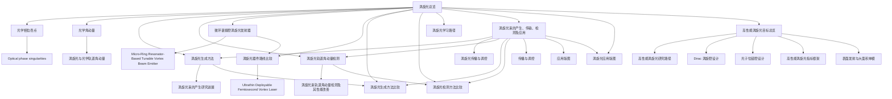

# 涡旋光主题图谱

本页不是单篇摘要，而是把当前 vault 里已经出现的涡旋光主线拉成一个可导航的关系图。

## 主线结构

## 当前可确认的关系

- [[涡旋光总览]] 是总入口，负责把主题拆成几条主线。
- [[光学相位奇点]] 是上位概念入口，负责说明涡旋结构和相位奇点之间的关系。
- [[光学角动量]] 负责把 `SAM` / `OAM` 的语言接到涡旋光主线。
- [[涡旋光生成方法]] 对应“如何产生涡旋光”这条主线。
- [[涡旋光传播与调控]] 对应“模式如何保持、演化和被工程控制”这条主线。
- [[涡旋光轨道角动量检测]] 对应“如何识别和测量 OAM”这条主线。
- [[微环谐振腔涡旋光发射器]] 对应片上器件实现。
- [[obsidian/raw/papers/Ultrathin Deployable Femtosecond Vortex Laser|Ultrathin Deployable Femtosecond Vortex Laser]] 补进了超薄 BIC 光子晶体飞秒涡旋激光器样例。
- [[涡旋光器件路线比较]] 用来把器件路线放在同一层观察。
- [[涡旋光生成方法比较]] 用来把不同生成机制和实现平台放到同一层观察。
- [[涡旋光检测方法比较]] 用来把不同 OAM 测量思路放到同一层观察。
- [[涡旋光应用版图]] 用来把当前已出现的应用方向放到同一层观察。
- [[高性能涡旋光目标总览]] 用来把现有页面重新压到“Dirac-vortex + disclination -> 高性能 / 大功率器件”这个目标上。
- [[高性能涡旋光指标框架]] 用来统一以后所有相关器件和路线的评价语言。
- [[表面发射与大面积单模]] 用来固定“大功率器件”里最容易被忽略的出光和单模问题。
- [[涡旋光学习路径]] 负责告诉你这些页面该按什么顺序读。

## 书级来源在图谱中的位置

[[涡旋光束的产生、传输、检测及应用]] 当前最适合充当图谱锚点，因为它天然覆盖：

- 产生
- 传输
- 检测
- 应用

它的作用不是替代单篇论文，而是给单篇论文之间补一条更稳定的中层框架。等后续拿到更多目录或正文信息后，这页最适合继续向外分叉出：

- `比较/涡旋光生成方法比较`
- `比较/涡旋光检测方法比较`
- `综述/涡旋光应用版图`

## 当前缺口

- 当前图谱更偏结构关系，还不是完整参数对比图。

## 推荐使用方式

- 想快速定位主题，先从 [[涡旋光总览]] 进入。
- 想按顺序读，先走 [[涡旋光学习路径]]。
- 想补图谱骨架，优先深读 [[涡旋光束的产生、传输、检测及应用]]。
