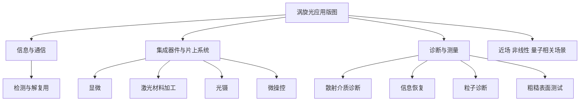

# 涡旋光应用版图

## 当前定位

这页不试图一次性枚举所有应用，而是把当前知识库中已经出现、且有来源支撑的应用方向先拉成一个中层地图。

## 当前可确认的应用主线

### 1. 信息与通信

基于 [[涡旋光束轨道角动量检测及其性能改善]]，当前可以确认：

- OAM 检测问题直接关系到多路复用通信中的解复用与检索
- 检测性能不是孤立实验指标，而是通信应用是否可行的一部分

这说明通信不是涡旋光研究的外围应用，而是和检测路线深度耦合的核心场景之一。

### 2. 集成器件与片上系统

基于 [[Micro-Ring Resonator-Based Tunable Vortex Beam Emitter]]，当前可以确认：

- 片上可调涡旋光发射器面向 photonic integrated circuit 语境
- 首页摘要明确提到的应用包括：
  - 显微
  - 激光材料加工
  - 光镊

这说明涡旋光应用不只发生在自由空间实验台，也可以进入片上器件和工程化系统。

基于 [[超表面硅光偏振分束器制备及测试]]，当前还可以再补一个更偏平台侧的认识：

- 超表面硅光器件和片上测试流程，说明微纳加工平台本身就是应用落地的重要一层
- 后续如果进入超表面 OAM 调控或模式转换文献，这条支线可以自然并入“片上系统与功能器件”

基于 [[广义完美光学涡旋微操控（特邀）]]，当前还可以把“光镊 / 微操控”从应用点进一步提升成一个更明确的方向：

- 微操控不是附带例子，而是和特定涡旋光场结构设计直接耦合的任务场景
- `generalized perfect optical vortex` 和 `holographic optical tweezer` 同时出现，说明光场形式本身就是应用性能的一部分

### 3. 诊断与测量

基于 [[Optical phase singularities]]，当前可以确认：

- 相位奇点与涡旋结构相关方法可用于：
  - 随机散射介质诊断
  - 相位问题求解中的信息恢复
  - 粒子诊断
  - 粗糙表面测试

这类方向的重要性在于，它们把涡旋光从“特殊波前”推进到“可用于测量和反演的结构化光场”。

### 4. 近场、非线性与量子相关场景

同样基于 [[Optical phase singularities]]，当前可以确认：

- 相位奇点相关结构还被放入以下语境中讨论：
  - 非线性光学相互作用
  - 量子纠缠
  - 表面波等近场光场

这说明应用版图不应只按传统工程领域划分，还应留意不同物理平台中的迁移。

## 当前应用结构的直观图

## 与其他页面的关系

- 上位总览：[[涡旋光总览]]
- 图谱入口：[[涡旋光主题图谱]]
- 学习路径：[[涡旋光学习路径]]
- 传播关联：[[涡旋光传播与调控]]
- 检测关联：[[涡旋光轨道角动量检测]]
- 器件关联：[[微环谐振腔涡旋光发射器]]
- 平台补充：[[超表面硅光偏振分束器制备及测试]]
- 应用补充：[[广义完美光学涡旋微操控（特邀）]]

## 当前理解边界

- 这页目前是“应用地图”，不是应用综述全文。
- 当前很多应用点仍然来自首页摘要级信息，而不是全文逐节核对后的结论。
- 后续应继续补：
  - 每个应用方向的代表文献
  - 该方向依赖的生成、传播、检测条件
  - 应用约束与评价指标
