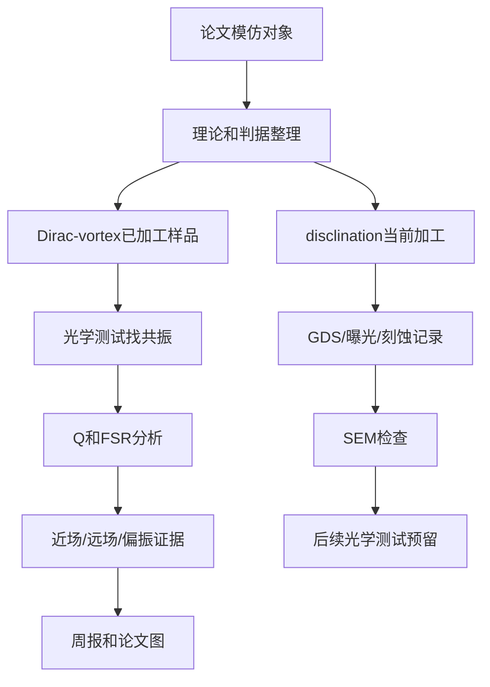

# 当前研究主线整理

## 一句话主线

当前工作分成两条并行线：**光学测试优先测 Dirac-vortex 已加工样品**；**微腔加工当前正在推进 disclination vortex 样品**。两条线都属于拓扑涡旋腔方向，但阶段和任务不同，记录时必须分开。

## 当前优先级

| 工作线 | 当前状态 | 当前优先任务 | 入口 |
|---|---|---|---|
| Dirac-vortex | 已加工完成 | 光学测试：找共振、拟合 Q/FSR、拍近场/远场 | [[微腔加工与光学测试/03-光学测试/10-测试数据/Dirac-vortex已加工样品光学测试入口|Dirac-vortex 已加工样品光学测试入口]] |
| disclination vortex | 正在加工 | 加工记录：GDS、曝光、刻蚀、SEM、问题排查 | [[微腔加工与光学测试/02-微腔加工/01-样品设计/Disclination当前加工入口|Disclination 当前加工入口]] |

## 两篇主要模仿对象

### 1. Dirac-vortex topological cavities

本路线的核心参考是：

`/Users/mac/Documents/mengjie/MengjieVault/codex_job/obsidian/raw/papers/03_topological_photonics/Dirac-vortex topological cavities.md`

它主要回答：

- 如何用 Dirac cone 和 Kekule 调制构造拓扑中隙腔模。
- 为什么 Dirac-vortex cavity 适合大面积单模和表面发射。
- 为什么要测 Q 和 FSR，并且要看它们随 vortex size 的变化。
- 为什么光学测试不能只看一个峰，还要看远场图样和模式数量。

当前对应笔记：

- [[Dirac-vortex 理论知识]]
- [[00-索引]]
- [[01]]
- [[02]]
- [[微腔加工与光学测试/03-光学测试/光学测试实验计划 1 1|光学测试实验计划 1 1]]
- [[微腔加工与光学测试/02-微腔加工/01-样品设计/Dirac-vortex已加工样品索引|Dirac-vortex 已加工样品索引]]
- [[微腔加工与光学测试/03-光学测试/10-测试数据/Dirac-vortex已加工样品光学测试入口|Dirac-vortex 已加工样品光学测试入口]]

### 2. Vortex nanolaser based on a photonic disclination cavity

本路线的核心参考是：

`/Users/mac/Documents/mengjie/MengjieVault/codex_job/obsidian/raw/papers/02_on_chip_lasers/Vortex nanolaser based on a photonic-unknown-Vortex nanolaser based on a photonic.md`

目前更有用的是已有剪藏整理：

`/Users/mac/Documents/mengjie/MengjieVault/codex_job/obsidian/raw/notes/Vortex nanolaser based on a photonic disclination cavity - source note.md`

它主要回答：

- 如何用 photonic disclination cavity（光子旋错腔）构造局域模式。
- 如何把 tight-binding 模型中的角动量标签连接到 FEM 光场和实验发射态。
- 为什么当前正在加工的 `disclination vortex` 需要重点记录几何参数、局域性和模式身份。

当前对应工作：

- [[微腔加工与光学测试/02-微腔加工/01-样品设计/Disclination当前加工入口|Disclination 当前加工入口]]
- [[微腔加工样品记录 2026-05-14]]
- [[微腔加工与光学测试/02-微腔加工/01-样品设计/MC-20260514-01-样品与器件索引|MC-20260514-01-样品与器件索引]]
- [[微腔加工与光学测试/02-微腔加工/02-版图设计/GDS-mj20260420-版图索引|GDS-mj20260420-版图索引]]

## 当前最重要的区分

| 项目 | Dirac-vortex 路线 | disclination vortex 路线 |
|---|---|---|
| 主要参考 | Gao et al., 2020 | Vortex nanolaser / photonic disclination cavity |
| 物理机制 | 质量项涡旋束缚中隙模 | 晶格旋错缺陷束缚局域模 |
| 目标优势 | 大面积单模、表面发射、Q/FSR 缩放 | 小尺度局域、角动量模式、纳米激光 |
| 当前样品对应 | 已加工完成，当前优先进入光学测试 | 正在加工，当前优先记录工艺和 SEM |
| 当前风险 | 测到共振后仍需远场、偏振和背景对照确认模式身份 | 不能把 disclination 结果直接说成 Dirac-vortex 结果 |

## 当前科研闭环

## 近期应优先补齐

- Dirac-vortex 光学测试前，补齐已加工样品的批次、GDS、SEM 和器件坐标。
- Dirac-vortex 测试时每个器件至少保留：
  - 原始光谱；
  - 重复扫描；
  - 无腔或远离腔区背景；
  - 偏振角；
  - 共振处和离共振处图像。
- Dirac-vortex 数据分析时先做 [[微腔加工与光学测试/05-数据分析/光谱分析/Q与FSR数据处理入口|Q与FSR数据处理入口]]。
- disclination 加工线继续补齐曝光、刻蚀、去胶、SEM 和工艺问题记录。
