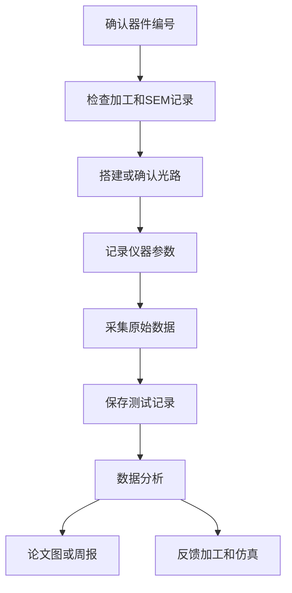

# 测试总流程

## 文件夹用途

这里记录微腔器件的光学测试过程，包括光路设计、仪器设置、测试数据、问题排查和数据处理入口。目标是让每一条光谱、远场图或干涉图都能追溯到器件、加工批次和测试条件。

## 推荐记录什么内容

- 测试平台搭建：平台布局、光源、物镜、探测器、光谱仪。
- 光路设计：光路图、透镜焦距、偏振元件、滤光片和耦合方式。
- 激光器：波长、功率、扫描范围、稳定性。
- 偏振系统：起偏器、半波片、四分之一波片角度。
- 显微系统：物镜倍率、NA（数值孔径，用来描述物镜收光能力）、照明方式。
- 探测器：型号、增益、积分时间、背景扣除方式。
- OSA 光谱仪：OSA 是 Optical Spectrum Analyzer，光学光谱分析仪；记录分辨率、扫描范围、灵敏度。
- 红外相机：曝光时间、增益、像素标定。
- 干涉与涡旋验证：干涉图、参考光设置、相位信息。
- 测试数据：原始数据路径、文件命名、备份位置。
- 数据处理：处理脚本、拟合方法、图像生成方式。

## 当前测试入口

- 当前测试计划：[[微腔加工与光学测试/03-光学测试/光学测试实验计划 1 1|光学测试实验计划 1 1]]
- 当前测试优先入口：[[微腔加工与光学测试/03-光学测试/10-测试数据/Dirac-vortex已加工样品光学测试入口|Dirac-vortex 已加工样品光学测试入口]]
- Dirac-vortex 测试判据：[[微腔加工与光学测试/03-光学测试/01-测试平台搭建/Dirac-vortex光学测试判据总结|Dirac-vortex 光学测试判据总结]]
- disclination 后续测试预留：[[微腔加工与光学测试/03-光学测试/10-测试数据/MC-20260514-01-光学测试入口|MC-20260514-01 光学测试入口]]
- 光谱分析入口：[[微腔加工与光学测试/05-数据分析/光谱分析/Q与FSR数据处理入口|Q与FSR数据处理入口]]
- 学习路线：[[演示/量子力学/00-索引]]
- 共振入门：[[演示/量子力学/01]]
- Q/FSR 入门：[[02]]

## 推荐测试闭环



## 和其他文件夹如何双链关联

- 测试记录必须链接器件页：`[[DV-DISC-2026-001]]`。
- 测试前链接 SEM 记录，判断结构是否值得测试。
- 测试记录链接到 [[微腔加工与光学测试/05-数据分析/00-数据分析索引|数据分析索引]]。
- 异常现象链接到 [[微腔加工与光学测试/templates/问题排查模板|问题排查模板]]。
- 可发表结果链接到 [[微腔加工与光学测试/06-论文与汇报/00-论文汇报索引|论文与汇报]]。

## 推荐双链格式

```markdown
器件：[[DV-DISC-2026-001]]
加工批次：[[加工批次-2026-05-14-DV-DISC-2026-001]]
SEM：[[SEM-DV-DISC-2026-001-2026-05-14]]
测试记录：[[测试-2026-05-14-DV-DISC-2026-001]]
数据分析：[[分析-2026-05-14-DV-DISC-2026-001]]
问题排查：[[问题-未观察到共振峰-DV-DISC-2026-001]]
```

## 测试前检查清单

- [ ] 器件编号已确认。
- [ ] 对应加工批次已找到。
- [ ] SEM 图片已检查。
- [ ] 光路图或平台状态已记录。
- [ ] 仪器参数已记录。
- [ ] 原始数据保存路径已确定。
- [ ] 背景、暗噪声或参考谱已采集。
